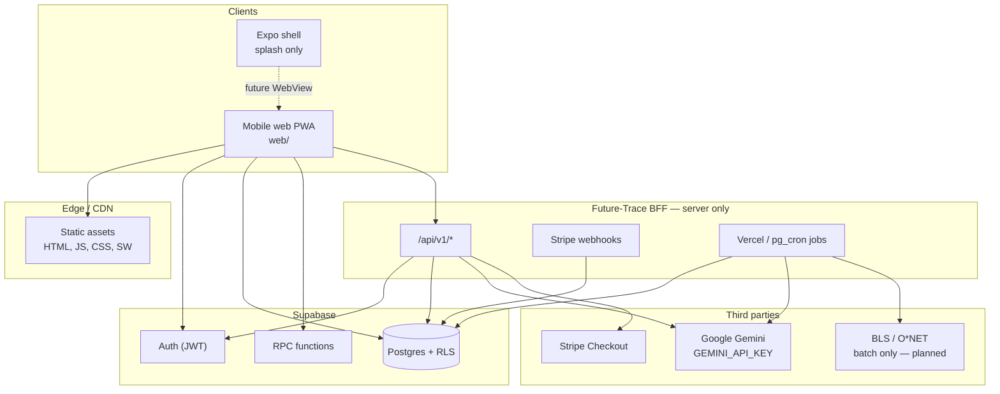
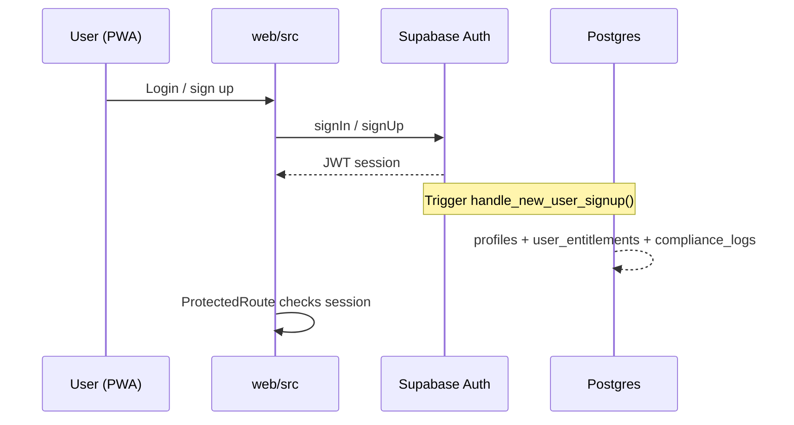
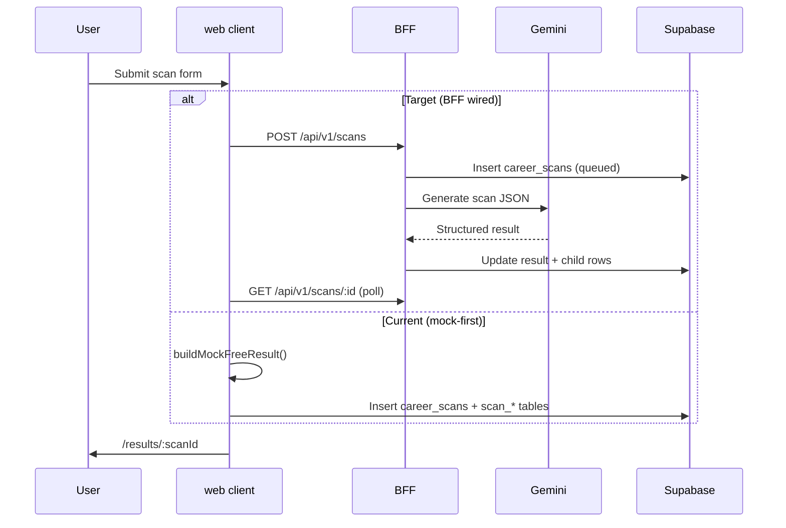
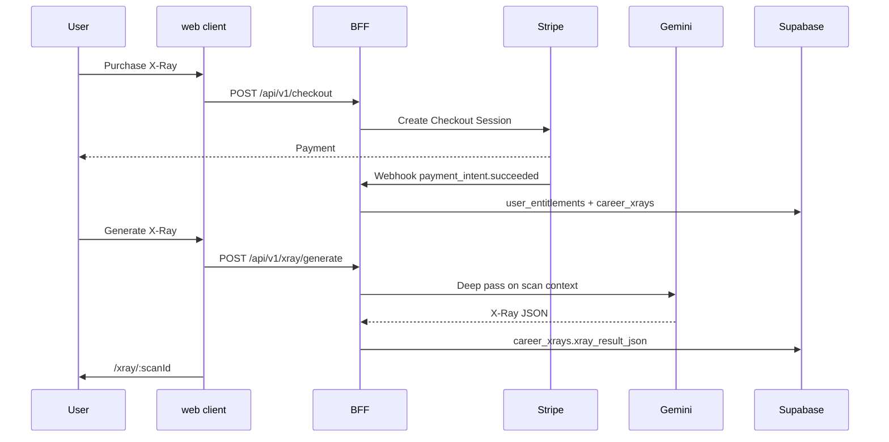
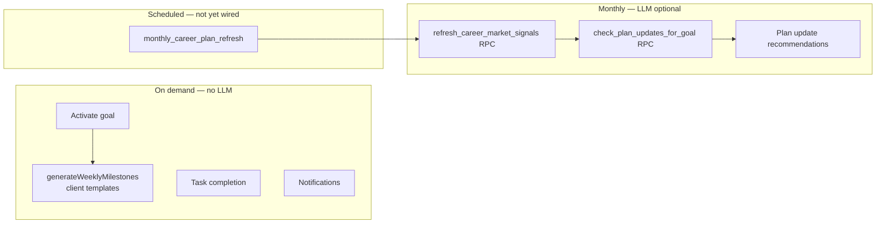
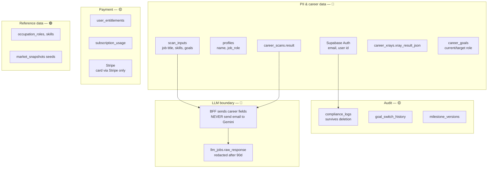
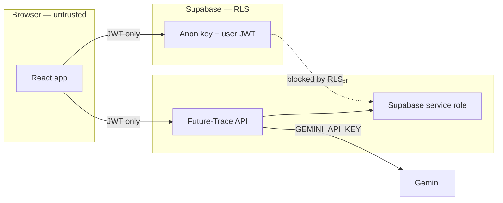

# Future Trace — Architecture & Data Flows

**Status:** Reference (as-built + target)  
**Audience:** Engineering, compliance review  
**Last updated:** June 2026  
**Scope:** Mobile web (`web/`), Future-Trace BFF, Supabase  
**Related:** [TECH_STACK.md](./TECH_STACK.md), [OBSOLETE_DB_TABLES.md](./OBSOLETE_DB_TABLES.md), [BACKEND_AND_LLM_STRATEGY.md](./BACKEND_AND_LLM_STRATEGY.md)

---

## 1. System overview

Future Trace is a **mobile-first PWA** (`web/`) backed by **Supabase** (auth + Postgres) and a **Next.js BFF** (`Future-Trace/`, separate repo) for LLM orchestration and Stripe. The Expo app at the repo root is splash-only; production users run the web app in a browser or as an installed PWA.

---

## 2. Layered architecture

| Layer | Technology | Responsibility |
|-------|------------|----------------|
| **Presentation** | React 19, Vite, Tailwind, React Router | UI, routing, PWA shell, bottom nav |
| **Client services** | `web/src/lib/*` | Supabase reads/writes, checkout client, transition logic |
| **Auth** | Supabase Auth | Email/password, OAuth, JWT sessions |
| **Data** | Supabase Postgres + RLS | User data, scans, X-Rays, goals, milestones |
| **BFF** | Future-Trace Next.js | LLM calls, Stripe, webhooks, cron — **keys never in browser** |
| **LLM** | Gemini 1.5 Flash (default) | Scan, X-Ray, plan-update signal copy — **server only** |
| **Payments** | Stripe Checkout + webhooks | $1.99 X-Ray, $9.99/mo AI Career Transition |
| **Static market data** | Seeded tables + weekly batch (planned) | Role taxonomy, benchmarks, market snapshots |

---

## 3. Request flows (by feature)

### 3.1 Authentication

**Compliance note:** Email is PII stored in `auth.users` and `profiles`. Display name sent as auth metadata.

---

### 3.2 Free Career Scan

| Aspect | Detail |
|--------|--------|
| **LLM?** | **Yes** (target) — once per unique input hash; cached on repeat |
| **Frequency** | On user submit; free tier: 1 scan / 7 days (`usage_limits`) |
| **Static data?** | Role taxonomy (`occupation_roles`) optional enrichment — **weekly batch**, not per request |
| **Compliance** | Form PII in `scan_inputs` (job title, skills, goals). Retention: free scans **>30 days** purged if no X-Ray/sub (`cleanup_old_career_scans`) |

---

### 3.3 Career X-Ray ($1.99)

| Aspect | Detail |
|--------|--------|
| **LLM?** | **Yes** — one deep pass per X-Ray generation |
| **Frequency** | On demand after payment; subscribers: up to **10 X-Rays/month** |
| **Static data?** | Cached role intelligence (planned) — **read from DB**, LLM only on cache miss |
| **Compliance** | Payment records; X-Ray contains inferred career PII — same retention as `career_scans` |

---

### 3.4 AI Career Transition ($9.99/mo)

| Operation | LLM? | Frequency |
|-----------|------|-----------|
| Milestone generation | **No** (template-based in `generateWeeklyMilestones.ts`) | Once per goal activation |
| Milestone unlock sync | **No** (RPC `sync_milestone_unlocks`) | On milestone fetch |
| Market signals refresh | **Partial** — RPC seeds signals; full LLM enrichment via BFF (planned) | **Monthly** per active goal / subscriber |
| Plan update check | **Partial** — server RPC + client draft logic | User-initiated or **monthly cron** |
| Notification scheduling | **No** | On milestone events |

---

## 4. LLM vs static data — frequency matrix

| Workload | LLM runs | Static / DB reads | Trigger | Target cadence |
|----------|----------|-------------------|---------|----------------|
| Free Career Scan | **Yes** | Optional market snapshot JSON | User submit | **Per scan** (cached by input hash) |
| Career X-Ray | **Yes** | Prior scan result | User after payment | **Per X-Ray** (≤10/mo subscriber) |
| Role intelligence page | **Yes** (cache miss) | `occupation_roles`, cached report | User navigation | **Once per role slug**, then DB |
| AI transition milestones | **No** | Blueprint templates in code | Goal activation | **Once per goal** |
| Plan update recommendations | **Light** (signal copy) | `career_market_signals` | Manual check or cron | **Monthly** |
| Radar dashboard (legacy) | **Yes** (planned) | `radar_snapshots` | Monthly cron | **1×/month/subscriber** |
| Home dashboard | **No** | `career_goals`, milestones, entitlements | Page load | **Every visit** (DB only) |
| Market benchmarks | **No** | `salary_observations`, `role_demand_*` (seeded) | Batch ETL | **Weekly** (planned) |
| BLS / O*NET ingest | **No** | External APIs → `market_snapshots` | Cron | **Weekly** (planned) |
| Entitlements / usage | **No** | `user_entitlements`, `subscription_usage` | Every gated action | **Real-time** |

**Rule of thumb:** LLM runs on **user-initiated intelligence** (scan, X-Ray) and **scheduled personalization** (monthly plan/radar refresh). Everything else is **Postgres + static seeds**.

---

## 5. Compliance & privacy risk map

Legend: 🔴 High sensitivity · 🟡 Medium · 🟢 Low

### 5.1 Risk areas & mitigations

| Area | Risk | Current mitigation | Gap |
|------|------|-------------------|-----|
| **Scan form → LLM** | Career PII in prompts | BFF-only; no client LLM | Enforce redaction checklist in BFF prompts |
| **scan_inputs** | Immutable PII store | RLS: own rows only | Export/delete UX not wired in Profile |
| **career_scans retention** | 30-day purge for free tier | `cleanup_old_career_scans` cron daily | Confirm cron enabled in Supabase Dashboard |
| **llm_jobs.raw_response** | Full LLM payloads | Redacted after 90 days | Ensure BFF writes to `llm_jobs` |
| **compliance_logs** | Survives account delete | By design (legal audit) | Wire `log_compliance_event` from delete flow |
| **Stripe** | PCI | Stripe Checkout hosted | No card data in Supabase ✓ |
| **Service role key** | Full DB access | Server/dev only | Never `VITE_*` expose |
| **sessionStorage** | Client-side entitlements legacy | Mostly replaced by `user_entitlements` | Audit remaining mock paths |
| **Third-party fonts** | Google Fonts CDN | External request | Self-host for strict privacy policy |
| **PWA service worker** | Caches shell offline | Network-first for API | Do not cache authenticated API responses in SW |

### 5.2 Data retention summary

| Data | Retention | Mechanism |
|------|-----------|-----------|
| Free-tier scans | 30 days | `cleanup_old_career_scans()` — daily cron |
| Paid X-Ray / subscriber scans | Until account delete | Cascade from `auth.users` |
| `llm_jobs.raw_response` | 90 days then redacted | `cleanup_old_llm_jobs()` — daily cron |
| Integration staging | 30 days | `cleanup_integration_staging_raw()` |
| `compliance_logs` | Indefinite | Audit trail |

See [supabase/docs/COMPLIANCE.md](../supabase/docs/COMPLIANCE.md).

---

## 6. Security boundaries

**Never in the browser:** `GEMINI_API_KEY`, `STRIPE_SECRET_KEY`, `SUPABASE_SERVICE_ROLE_KEY`.

---

## 7. Deployment topology (target production)

| Component | Host | URL pattern |
|-----------|------|-------------|
| PWA | Vercel / Netlify / Cloudflare Pages | `app.futuretrace.com` |
| BFF | Vercel (Future-Trace) | `api.futuretrace.com` or same-origin `/api` proxy |
| Database | Supabase Cloud | Project-specific |
| Stripe | Stripe Dashboard | Webhooks → BFF |
| Cron | Supabase pg_cron + Vercel cron | Daily cleanup + monthly plan refresh |

---

## 8. Current vs target state

| Capability | Current (June 2026) | Target for go-live |
|------------|---------------------|-------------------|
| Scan content | Mock templates in `scanService.ts` | BFF + Gemini |
| X-Ray content | Mock fallback if BFF fails | BFF + Gemini required |
| Checkout | Dev plugin + partial BFF | Production Stripe webhooks |
| Transition milestones | Real DB, template-generated | Same (no LLM required) |
| Plan updates | Real RPCs when migrations applied | + monthly cron |
| Radar UI | Redirects to `/transition`; legacy mock page | Deprecated or wired to snapshots |
| PWA | Manifest + SW + install prompt | ✓ Done |
| Market data ETL | Tables seeded, no live ingest | Weekly batch (post-MVP OK) |
