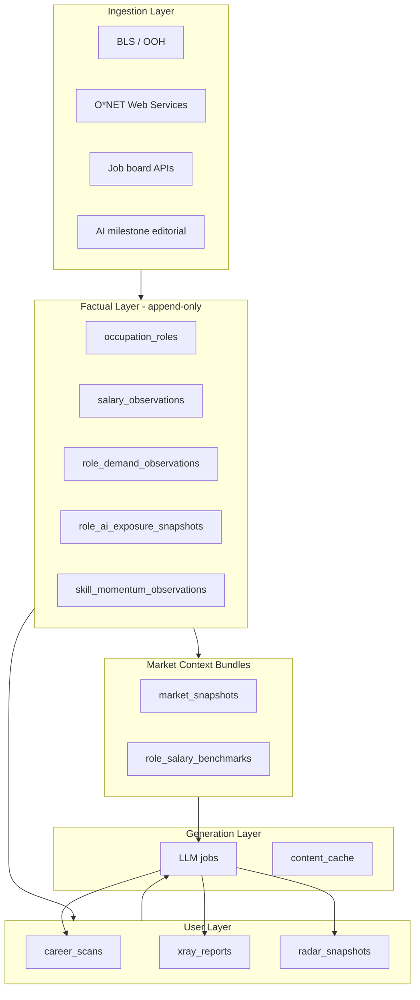
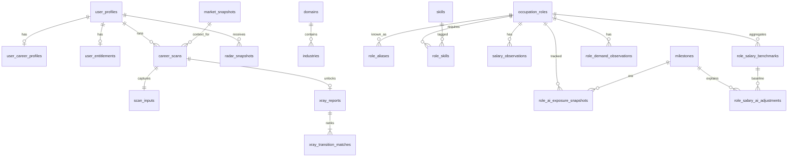
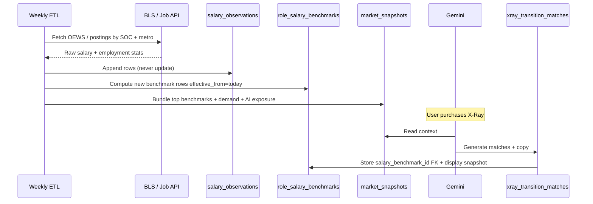

# Future Trace V1 — Database Design

**Status:** Planning document (no implementation)  
**Audience:** Sammy  
**Last updated:** June 2026  
**Scope:** Mobile web (`web/`), Expo app, Supabase Postgres, and alignment with `Future-Trace/`  
**Related:** [BACKEND_AND_LLM_STRATEGY.md](./BACKEND_AND_LLM_STRATEGY.md)

---

## 1. Purpose

This document defines a detailed Postgres schema for V1 based on current product features:

| Product | Price | Core output |
|---------|-------|-------------|
| Career Resilience Scan | Free | Resilience index, AI exposure, strengths/vulnerabilities, transition role names |
| Career X-Ray | $1.99 one-time | Full X-Ray report, 5 transition roles, skill gap table, role intelligence |
| AI Career Radar | $9.99/mo | Readiness dashboard, market demand, skill gap movement, monthly signals |

It maps directly to TypeScript types in `web/src/types/index.ts` and mock shapes in `web/src/data/mockData.ts`.

### Design principles

1. **Separate facts from interpretations** — salaries, job counts, and O*NET/BLS stats are append-only observations; scan/X-Ray/Radar outputs are versioned user artifacts.
2. **Time-series by default** — anything that can drift (salary, demand, AI exposure) gets `(entity, geo, domain, as_of_date)` rows, never in-place overwrites.
3. **Normalize roles & skills once** — free-text job titles from users map to canonical occupations; salaries attach to canonical roles, not raw strings.
4. **AI evolution is a first-class timeline** — extend existing `milestones` to explain *why* a role’s salary band or demand changed over time.
5. **Hybrid ingestion** — external API → staging → curated facts → LLM synthesis → stored user report.

Most market intelligence comes from **API integrations**. User-facing copy and personalized scores come from **LLM** using those facts as context.

---

## 2. Feature → data mapping

| V1 feature / screen | Primary tables | External data used |
|---------------------|----------------|--------------------|
| Login / Profile | `user_profiles`, `user_career_profiles` | Supabase Auth |
| Career Scan form | `career_scans`, `scan_inputs` | — |
| Scan results | `career_scans.result`, `scan_transition_role_suggestions` | `occupation_roles`, `role_ai_exposure_snapshots`, `role_demand_observations` |
| Career X-Ray ($1.99) | `xray_reports`, `xray_skill_gaps`, `xray_transition_matches` | Same + `role_salary_benchmarks` |
| Role intelligence (`/xray/role/:slug`) | `role_intelligence_cache`, `role_intelligence_reports` | Salary + demand + skills snapshots |
| AI Career Radar ($9.99/mo) | `radar_snapshots`, `radar_signals`, `radar_insight_items` | Monthly refresh from latest market facts |
| Home dashboard | Derived from latest scan + latest radar snapshot | Aggregated benchmarks |
| Paywall / entitlements | `user_entitlements`, `purchases`, `subscriptions` | Stripe |
| Live market sidebar (future) | `market_signals`, `skill_momentum_observations` | Job APIs, BLS, O*NET |

---

## 3. Architecture layers



---

## 4. Domain model overview

### Layer A — Identity, billing, entitlements

#### `user_profiles`

Extend existing `Future-Trace` `profiles` / `user_profiles`.

| Column | Type | Notes |
|--------|------|-------|
| `id` | uuid PK | = `auth.users.id` |
| `display_name` | text | |
| `email` | text | denormalized for support |
| `avatar_url` | text | optional |
| `onboarding_completed_at` | timestamptz | after 3 onboarding slides |
| `stripe_customer_id` | text | |
| `created_at` / `updated_at` | timestamptz | |

#### `user_career_profiles`

Latest known career state; scan form also snapshots per scan.

| Column | Type | Notes |
|--------|------|-------|
| `user_id` | uuid PK/FK | |
| `current_job_title_raw` | text | user-entered |
| `current_role_id` | uuid FK → `occupation_roles` | nullable until normalized |
| `industry_raw` | text | |
| `industry_id` | uuid FK → `industries` | nullable |
| `domain_id` | uuid FK → `domains` | e.g. Healthcare CRM ops |
| `years_experience` | smallint | |
| `work_preference` | enum | `technical`, `business`, `hybrid` |
| `career_goal_text` | text | |
| `focus_area` | text | e.g. "AI Operations" |
| `updated_at` | timestamptz | |

#### `user_skills` / `user_tools`

| Column | Type |
|--------|------|
| `user_id` | uuid |
| `skill_id` | uuid FK → `skills` (nullable if unmatched) |
| `label_raw` | text |
| `proficiency` | smallint 0–100 optional |
| `source` | enum `scan_form`, `profile_edit`, `inferred` |

#### `user_entitlements`

| Column | Type | Notes |
|--------|------|-------|
| `user_id` | uuid PK | |
| `free_scans_remaining` | int | default 1 |
| `has_career_xray` | boolean | one-time unlock |
| `xray_unlocked_at` | timestamptz | |
| `xray_source_scan_id` | uuid FK | scan that X-Ray was generated from |
| `has_radar` | boolean | |
| `radar_subscription_id` | uuid FK → `subscriptions` | |
| `subscription_expires_at` | timestamptz | already in Future-Trace migrations |

#### `products` / `purchases` / `subscriptions`

Align with Stripe SKUs:

| Product | `products.id` | Type |
|---------|-----------------|------|
| Career Resilience Scan | `free-scan` | quota |
| Career X-Ray | `xray` | one-time `purchases` |
| AI Career Radar | `radar` | recurring `subscriptions` |

**`purchases`:** `user_id`, `product_id`, `stripe_payment_intent_id`, `amount_cents`, `status`, `grants_xray_for_scan_id` (optional).

---

### Layer B — Taxonomy (canonical reference data)

Curated + API-enriched, not user-owned.

#### `domains`

Cross-industry career domains (broader than industry).

| Column | Example |
|--------|---------|
| `slug` | `healthcare-ops`, `enterprise-saas`, `fintech` |
| `name` | Healthcare Operations |
| `parent_domain_id` | optional hierarchy |

#### `industries`

Reuse existing `Future-Trace` table — link to `domain_id`, keep editorial AI-use fields.

#### `occupation_roles`

Canonical roles (spine for salary & demand).

| Column | Type | Notes |
|--------|------|-------|
| `id` | uuid PK | |
| `slug` | text unique | `ai-operations-analyst` |
| `title` | text | display name |
| `soc_code` | text | O*NET / SOC for API joins |
| `onet_code` | text | |
| `role_family` | text | e.g. `operations`, `engineering` |
| `description` | text | from O*NET |
| `is_active` | boolean | |

#### `role_aliases`

Maps messy titles → canonical role.

| Column | Notes |
|--------|-------|
| `alias_text` | "Salesforce Admin", "SFDC Administrator" |
| `occupation_role_id` | FK |
| `match_confidence` | numeric |
| `source` | `onet`, `manual`, `llm_normalized` |

#### `skills`

| Column | Notes |
|--------|-------|
| `slug`, `name` | |
| `skill_type` | `technical`, `soft`, `tool`, `domain` |
| `onet_element_id` | optional link |

#### `role_skills`

Required skills per role (from O*NET + editorial).

| Column | Notes |
|--------|-------|
| `occupation_role_id` | |
| `skill_id` | |
| `importance` | 0–100 |
| `level_required` | 0–100 |
| `is_emerging` | boolean |

#### `role_adjacency`

For “adjacent roles” in role intelligence.

| Column | Notes |
|--------|-------|
| `from_role_id`, `to_role_id` | |
| `relationship_type` | |
| `weight` | |

---

### Layer C — Career scan pipeline (free tier)

#### `career_scans`

| Column | Type | Maps to `CareerScan` |
|--------|------|----------------------|
| `id` | uuid PK | `id` |
| `user_id` | uuid FK | |
| `status` | enum | `queued`, `processing`, `complete`, `failed` |
| `input_hash` | text | dedupe / cache key |
| `prompt_version` | text | |
| `llm_job_id` | uuid FK | |
| `resilience_score` | smallint | 0–100 |
| `ai_exposure_score` | smallint | `aiExposure` |
| `ai_exposure_level` | enum | low/medium/high |
| `risk_level` | enum | low/medium/high |
| `summary` | text | |
| `result` | jsonb | full typed payload for re-render |
| `created_at` | timestamptz | `date` |

#### `scan_inputs`

Normalized form snapshot (immutable). Fields from `CareerScanPage`:

| Column | From scan form |
|--------|----------------|
| `scan_id` | FK |
| `job_title_raw` | Current Job Title |
| `industry_raw` | Industry |
| `years_experience` | |
| `current_skills_text` | |
| `tools_used_text` | |
| `career_goal_text` | Career Goal |
| `work_preference` | Technical / Business / Hybrid |
| `normalized_role_id` | FK after title normalization |
| `normalized_industry_id` | FK |

#### `scan_result_items`

Optional relational breakdown (for SQL analytics beyond JSONB):

| Table | Purpose |
|-------|---------|
| `scan_strengths` | `scan_id`, `label`, `sort_order` |
| `scan_vulnerabilities` | same |
| `scan_opportunity_zones` | same |
| `scan_transition_role_suggestions` | `scan_id`, `occupation_role_id`, `rank`, `title_snapshot`, `match_score` nullable until X-Ray |

#### `scan_generation_context`

What facts were fed to the LLM (audit trail).

| Column | Notes |
|--------|-------|
| `scan_id` | |
| `market_snapshot_id` | FK |
| `salary_benchmark_ids` | uuid[] |
| `exposure_snapshot_ids` | uuid[] |
| `demand_observation_ids` | uuid[] |

---

### Layer D — Career X-Ray (paid, one-time deep report)

#### `xray_reports`

| Column | Maps to |
|--------|---------|
| `id` | uuid |
| `user_id` | |
| `scan_id` | FK — X-Ray enriches a specific scan |
| `status` | processing / complete |
| `payload` | jsonb — full `XRayCompleteReport` |
| `future_readiness_score` | denormalized |
| `top_role_id` | FK → `occupation_roles` |
| `market_outlook` | text |
| `recommended_action` | text |
| `prompt_version` | |
| `created_at` | |

#### `xray_skill_gaps`

Maps to `XRayCompleteSkillGap[]`.

| Column | Notes |
|--------|-------|
| `xray_report_id` | |
| `skill_id` | |
| `gap_level` | Small / Moderate / Large |
| `impact_level` | Medium / High |
| `benefit_text` | |
| `sort_order` | |

#### `xray_transition_matches`

Maps to `XRayTransitionRole[]`.

| Column | Notes |
|--------|-------|
| `xray_report_id` | |
| `occupation_role_id` | canonical |
| `rank` | 1–5 |
| `match_score` | |
| `difficulty` | Low/Moderate/High |
| `transition_time_label` | "6–12 months" |
| `why_it_fits` | text |
| `trend` | rising/stable/declining |
| `salary_benchmark_id` | FK → `role_salary_benchmarks` used at generation time |
| `salary_display` | text snapshot "$115k–$140k" for historical accuracy |

#### `role_intelligence_reports`

Per user + role, or shared cache.

| Column | Notes |
|--------|-------|
| `id` | |
| `user_id` | nullable if global cache |
| `xray_report_id` | nullable |
| `occupation_role_id` | |
| `slug` | |
| `payload` | jsonb — `RoleIntelligenceReport` |
| `match_score` | |
| `salary_benchmark_id` | FK — which benchmark was cited |
| `demand_observation_id` | FK |
| `expires_at` | invalidate when new market snapshot |
| `is_cached_template` | boolean |

Store full JSONB **and** FK pointers to the factual rows that powered salary/demand fields.

---

### Layer E — AI Career Radar (subscription, time-series)

#### `radar_snapshots`

One row per billing period / refresh.

| Column | Maps to |
|--------|---------|
| `id` | |
| `user_id` | |
| `scan_id` | anchor profile |
| `xray_report_id` | optional |
| `period_start` | date (month) |
| `period_end` | date |
| `readiness_score` | `RadarDashboard.readinessScore` |
| `readiness_label` | |
| `peer_percentile_label` | |
| `score_trend_label` | "+5 vs last month" |
| `payload` | jsonb — full `RadarDashboard` |
| `insights_payload` | jsonb — `RadarInsights` |
| `market_snapshot_id` | FK |
| `prompt_version` | |
| `created_at` | |

#### `radar_sub_metrics`

Readiness breakdown bars from `RadarDashboard.subMetrics`.

#### `radar_skill_gap_progress`

`{ name, current, target }` with `previous_snapshot_id` for delta.

#### `radar_signals`

Feed items (`RadarSignal`).

| Column | Notes |
|--------|-------|
| `user_id` | |
| `snapshot_id` | nullable — some signals global |
| `title`, `summary` | |
| `category` | High Growth / Stable / Declining / Emerging |
| `impact` | low/medium/high |
| `trend` | up/down/flat |
| `signal_date` | |
| `source_signal_id` | FK → `market_signals` if from factual layer |

#### `radar_insight_items`

Structured sections: skill gap changes, emerging skills, role demand, personalized alerts.

| Column | Notes |
|--------|-------|
| `snapshot_id` | |
| `section_type` | |
| `title`, `summary` | |
| `category`, `impact`, `trend` | |
| `sort_order` | |

#### `radar_monthly_diffs`

Precomputed month-over-month deltas.

| Column | Notes |
|--------|-------|
| `user_id` | |
| `from_snapshot_id` | |
| `to_snapshot_id` | |
| `readiness_delta` | |
| `skill_gap_deltas` | jsonb |
| `salary_band_changes` | jsonb |

---

### Layer F — Factual market database (salaries, demand, skills)

Core requirement: **salaries that change frequently, stored factually across domains and roles, with history for AI-evolution tracking.**

#### F.1 Geography & sources

**`geo_markets`**

| Column | Example |
|--------|---------|
| `id` | |
| `slug` | `us-national`, `us-sf-bay`, `us-dallas` |
| `country_code` | US |
| `region_type` | national, metro, state |
| `bls_area_code` | for API joins |

**`data_sources`**

| Column | Example |
|--------|---------|
| `id` | |
| `slug` | `bls_oews`, `onet`, `adzuna`, `lightcast`, `llm_estimate`, `manual` |
| `name` | |
| `reliability_tier` | 1 = authoritative, 3 = estimate |
| `refresh_cadence` | weekly, monthly, quarterly |
| `api_config` | jsonb — endpoints, rate limits (no secrets; use vault refs) |

#### F.2 Salary observations (append-only facts)

**`salary_observations`** — raw ingested rows, never updated.

| Column | Type | Notes |
|--------|------|-------|
| `id` | uuid PK | |
| `occupation_role_id` | uuid FK | **required** |
| `domain_id` | uuid FK nullable | Healthcare vs Tech same title → different bands |
| `industry_id` | uuid FK nullable | finer slice |
| `geo_market_id` | uuid FK | |
| `source_id` | uuid FK → `data_sources` | |
| `observed_at` | date | when data was valid / published |
| `ingested_at` | timestamptz | when you pulled it |
| `currency` | char(3) | USD |
| `percentile_10` | integer | pick one convention: annual cents or dollars |
| `percentile_25` | integer | |
| `median` | integer | |
| `percentile_75` | integer | |
| `percentile_90` | integer | |
| `sample_size` | integer nullable | |
| `employment_count` | integer nullable | from BLS |
| `raw_payload` | jsonb | original API fragment |
| `external_id` | text | idempotent ingest key |
| `confidence_score` | numeric 0–1 | lower for LLM-estimated |

**Unique constraint:** `(source_id, external_id)` or `(role_id, domain_id, geo_id, source_id, observed_at, percentile_type)`.

**`role_salary_benchmarks`** — curated aggregates the app displays.

| Column | Notes |
|--------|-------|
| `id` | |
| `occupation_role_id` | |
| `domain_id` | nullable = all domains |
| `geo_market_id` | |
| `effective_from` | date |
| `effective_to` | date nullable — open-ended until superseded |
| `entry_min`, `entry_max` | |
| `mid_min`, `mid_max` | |
| `senior_min`, `senior_max` | |
| `display_range` | "$95K – $135K" |
| `methodology` | `weighted_median`, `bls_only`, `blended` |
| `source_observation_ids` | uuid[] — lineage |
| `computed_at` | timestamptz |

**Rule:** UI and LLM always reference a **`role_salary_benchmarks.id`**, not live API calls. When benchmarks refresh, insert a **new row** with new `effective_from`; old rows stay for history.

#### F.3 Demand & job market facts

**`role_demand_observations`**

| Column | Notes |
|--------|-------|
| `occupation_role_id`, `domain_id`, `geo_market_id` | |
| `source_id` | |
| `observed_at` | date |
| `openings_count` | integer nullable |
| `openings_label` | "1.2k+" for display |
| `demand_index` | 0–100 normalized |
| `demand_tag` | Very High / Stable / Declining |
| `yoy_change_pct` | numeric |
| `cagr_pct` | numeric — for role intelligence |
| `raw_payload` | jsonb |

**`skill_momentum_observations`**

| Column | Maps to home `radarItems` |
|--------|---------------------------|
| `skill_id` | |
| `domain_id` | optional |
| `observed_at` | |
| `growth_pct_label` | "+45%" |
| `momentum_score` | numeric |
| `source_id` | |

**`market_signals`** — editorial + API-derived global signals.

| Column | Notes |
|--------|-------|
| `title`, `summary` | |
| `category`, `impact`, `trend` | |
| `related_role_ids` | uuid[] |
| `related_skill_ids` | uuid[] |
| `related_milestone_id` | FK → AI evolution |
| `published_at` | |
| `source_id` | |

---

### Layer G — AI evolution impact tracking

Extend existing **`milestones`** table (AI evolution timeline) into quantitative tracking.

#### `ai_evolution_eras`

Optional grouping: pre-LLM, copilot era, agentic AI, etc.

| Column | Notes |
|--------|-------|
| `id`, `slug`, `name` | |
| `start_date`, `end_date` | |
| `description` | |

#### `role_ai_exposure_snapshots`

How AI affects a role at a point in time.

| Column | Notes |
|--------|-------|
| `occupation_role_id` | |
| `domain_id` | exposure differs by domain |
| `milestone_id` | FK — which AI era |
| `as_of_date` | date |
| `exposure_score` | 0–100 |
| `exposure_level` | low/medium/high |
| `automation_risk_pct` | numeric |
| `augmentation_opportunity_pct` | numeric |
| `tasks_at_risk` | jsonb — list of task categories |
| `source_id` | O*NET + LLM + editorial |
| `methodology_version` | |

#### `role_demand_ai_adjustments`

Demand shift attributed to AI.

| Column | Notes |
|--------|-------|
| `occupation_role_id`, `domain_id`, `milestone_id`, `as_of_date` | |
| `baseline_demand_index` | before AI adjustment |
| `adjusted_demand_index` | after |
| `demand_delta_pct` | |
| `narrative` | short explanation |

#### `role_salary_ai_adjustments`

Recommended salary impact from AI evolution.

| Column | Notes |
|--------|-------|
| `occupation_role_id`, `domain_id`, `geo_market_id`, `milestone_id`, `as_of_date` | |
| `baseline_benchmark_id` | FK → `role_salary_benchmarks` |
| `adjusted_benchmark_id` | FK — new recommended band |
| `salary_delta_pct` | e.g. +8% premium for AI-augmented ops |
| `adjustment_reason` | `skill_premium`, `automation_discount`, `demand_surge`, `regulatory_premium` |
| `narrative` | for UI tooltips |

#### `role_evolution_timeline`

Product-facing “how this role changed.”

| Column | Notes |
|--------|-------|
| `occupation_role_id` | |
| `milestone_id` | |
| `headline`, `body` | |
| `salary_delta_pct`, `demand_delta_pct`, `exposure_delta` | |

Example product copy enabled by this layer:

> *“Since GPT-4 class copilots (Milestone X), AI Operations Analyst median salary in Healthcare rose 12% while Manual Reporting Analyst demand fell 21%.”*

#### `market_snapshots`

Weekly bundle for LLM context.

| Column | Notes |
|--------|-------|
| `id` | |
| `snapshot_date` | |
| `domain_id` | nullable = global |
| `payload` | jsonb — top skills, role growth labels, salary band refs |
| `benchmark_ids` | uuid[] |
| `milestone_id` | current era marker |
| `created_at` | |

---

### Layer H — API integration & ETL

**`integration_sync_jobs`**

| Column | Notes |
|--------|-------|
| `id` | |
| `source_id` | FK → `data_sources` |
| `job_type` | `salary_pull`, `demand_pull`, `onet_sync` |
| `schedule_cron` | |
| `is_active` | |

**`integration_sync_runs`**

| Column | Notes |
|--------|-------|
| `job_id` | |
| `started_at`, `finished_at` | |
| `status` | |
| `rows_inserted` | |
| `error_message` | |
| `cursor` | |

**`integration_staging_raw`** (optional; short retention)

| Column | Notes |
|--------|-------|
| `source_id` | |
| `fetched_at` | |
| `payload` | jsonb |
| `processed_at` | |

**`title_normalization_requests`**

| Column | Notes |
|--------|-------|
| `raw_title` | |
| `resolved_role_id` | |
| `confidence` | |
| `resolver` | rules / llm |
| `created_at` | |

When a user enters “Salesforce Administrator”, log the mapping for improving aliases.

---

### Layer I — LLM orchestration & caching

**`llm_jobs`**

| Column | Notes |
|--------|-------|
| `id` | |
| `job_type` | `career_scan`, `xray`, `role_intel`, `radar_refresh` |
| `user_id` | |
| `related_entity_type` / `related_entity_id` | scan_id, etc. |
| `model` | gemini-1.5-flash |
| `prompt_version` | |
| `input_tokens`, `output_tokens` | |
| `status`, `error` | |
| `raw_response` | jsonb — debug only, redact PII |
| `created_at` | |

**`prompt_versions`**

| Column | Notes |
|--------|-------|
| `feature` | |
| `version` | |
| `system_prompt` | |
| `schema_version` | |
| `is_active` | |

**`content_cache`**

| Key | TTL |
|-----|-----|
| `(role_id, geo_id, domain_id, market_snapshot_id)` → role intel template | until next snapshot |
| `(input_hash)` → scan result | forever |

---

## 5. Key relationships (ER sketch)



---

## 6. How salaries flow end-to-end



### Display rules

- **X-Ray:** Show `salary_display` from the report row **plus** `benchmark.effective_from` / source disclaimer — a user who bought X-Ray in June still sees June numbers even if July benchmarks differ.
- **Radar:** On monthly refresh, join **latest** benchmarks for the user’s domain + geo, compute deltas vs prior snapshot, store in `radar_monthly_diffs`.

---

## 7. Domain × role × geo indexing

Salaries are not one-dimensional. Recommended composite indexes:

```sql
-- observations
(occupation_role_id, domain_id, geo_market_id, observed_at DESC)
(occupation_role_id, geo_market_id, observed_at DESC)  -- domain-agnostic fallback

-- benchmarks (active row lookup)
(occupation_role_id, domain_id, geo_market_id, effective_from DESC)
WHERE effective_to IS NULL
```

### Fallback chain when domain-specific data is sparse

1. role + domain + metro  
2. role + domain + national  
3. role + national (all domains)  
4. role family aggregate  
5. LLM estimate row in `salary_observations` with `source = llm_estimate`, lowest confidence — flagged in UI

---

## 8. TypeScript type mapping

| Type field | Storage |
|------------|---------|
| `CareerScan.transitionRoles[]` | `scan_transition_role_suggestions.title_snapshot` + optional `occupation_role_id` |
| `XRayTransitionRole.salary` | `xray_transition_matches.salary_display` + FK to benchmark |
| `RoleIntelligenceReport.salary.*` | `role_intelligence_reports.payload` + benchmark FKs |
| `RoleIntelligenceReport.demand.cagr` | from `role_demand_observations.cagr_pct` at generation time |
| `RadarDashboard.marketDemand[]` | `radar_snapshots.payload` + underlying demand observations |
| `RadarInsights.skillGapChanges` | `radar_insight_items` + diff from prior snapshot |
| `HomeDashboard.careerPaths[].salary` | latest benchmarks for suggested roles |
| `Entitlements` | `user_entitlements` |

Reference: `web/src/types/index.ts`

---

## 9. Reuse from existing `Future-Trace` schema

| Existing | V1 use |
|----------|--------|
| `industries`, `industry_risks` | Domain/industry taxonomy + editorial |
| `milestones`, `milestone_job_tags` | AI evolution timeline → link to `role_ai_exposure_snapshots` |
| `score_jobs`, `exposure_scores` | Merge into `occupation_roles` + `role_ai_exposure_snapshots` over time |
| `plans`, `subscriptions`, `profiles` | Billing + entitlements |
| `user_resume_scans` | Parallel product; V1 uses `career_scans` with richer schema |

Avoid two scan tables long-term — either migrate matcher scans into `career_scans` with a `product_surface` column or keep separate with shared role taxonomy.

Reference migrations: `Future-Trace/supabase/migrations/`

---

## 10. Suggested ingestion cadence

| Data | Source | Cadence | Target table |
|------|--------|---------|--------------|
| Occupation definitions | O*NET | Monthly | `occupation_roles`, `role_skills` |
| Salary percentiles | BLS OEWS | Annual + interpolated monthly | `salary_observations` |
| Metro adjustments | BLS / 3rd party | Quarterly | `salary_observations` |
| Job posting volume | Adzuna / similar | Weekly | `role_demand_observations` |
| Skill trends | Aggregator or LLM batch | Weekly | `skill_momentum_observations` |
| AI exposure by role | O*NET tasks + LLM batch | Per milestone release | `role_ai_exposure_snapshots` |
| Display benchmarks | Internal ETL | Weekly | `role_salary_benchmarks` |
| LLM market bundle | Internal | Weekly | `market_snapshots` |
| Radar user refresh | Internal cron | Monthly per subscriber | `radar_snapshots` |

---

## 11. Security, RLS, and retention

> **Note:** This section is a summary. Full compliance, privacy, permissions, and data constraints are in **[§14 Compliance, privacy & permissions](#14-compliance-privacy--permissions)**.

| Table class | RLS |
|-------------|-----|
| User scans, X-Ray, Radar | `user_id = auth.uid()` |
| Reference taxonomy, salaries, milestones | public read, admin write |
| `salary_observations`, staging | service role only |
| `llm_jobs.raw_response` | service role only; strip email from prompts |

**Retention (summary):**

- Keep factual market observations indefinitely (non-PII aggregate data).
- Trim `integration_staging_raw` after 30 days.
- User PII and career inputs follow tiered retention in §14.6.
- Account deletion cascades user-owned rows; audit logs may be retained.

---

## 12. MVP vs later phases

### MVP (ship V1)

- `user_profiles`, `user_entitlements`, `career_scans`, `xray_reports`, `radar_snapshots`
- `occupation_roles`, `role_aliases`, `skills`
- `role_salary_benchmarks` (even if initially LLM-seeded + manual curation)
- `market_snapshots` (weekly JSON bundle)
- `data_sources`, basic ETL runs

### Phase 2 (factual salary DB)

- Full `salary_observations` append-only from BLS
- `geo_markets`, domain-scoped benchmarks
- `radar_monthly_diffs`

### Phase 3 (AI evolution analytics)

- `role_ai_exposure_snapshots` tied to `milestones`
- `role_salary_ai_adjustments`, `role_evolution_timeline`
- Product surfaces: “Salary since Copilot era”, “Demand impact of agentic AI”

---

## 13. Example query patterns

**Active salary band for role in Healthcare, US national:**

```sql
SELECT *
FROM role_salary_benchmarks
WHERE occupation_role_id = $1
  AND domain_id = $healthcare_domain
  AND geo_market_id = $us_national
  AND effective_to IS NULL
ORDER BY effective_from DESC
LIMIT 1;
```

**Salary trend for role across AI milestones:**

```sql
SELECT m.title AS era, b.display_range, b.effective_from, a.salary_delta_pct
FROM role_salary_ai_adjustments a
JOIN milestones m ON m.id = a.milestone_id
JOIN role_salary_benchmarks b ON b.id = a.adjusted_benchmark_id
WHERE a.occupation_role_id = $1 AND a.domain_id = $2
ORDER BY a.as_of_date;
```

**Radar month-over-month skill gap movement:**

```sql
SELECT curr.skill_id, curr.current AS current_pct, prev.current AS prior_pct
FROM radar_skill_gap_progress curr
JOIN radar_skill_gap_progress prev ON prev.snapshot_id = $prior_snapshot
WHERE curr.snapshot_id = $current_snapshot;
```

---

## 14. Compliance, privacy & permissions

This section defines **data classification, retention, access control, and regulatory constraints** for V1. It extends patterns already implemented in `Future-Trace/supabase/migrations/20260530120000_gdpr_ccpa_compliance_data_layer.sql` and documented in `Future-Trace/supabase/docs/COMPLIANCE.md`.

**Regulatory targets (planning assumption):** GDPR (EU/UK users), CCPA/CPRA (California users), and general US privacy best practices. Legal review required before launch copy and final retention periods.

---

### 14.1 Data classification

| Class | Description | Examples in V1 | Storage rule |
|-------|-------------|----------------|--------------|
| **Account PII** | Direct identifiers | `email`, `display_name`, `stripe_customer_id` | Encrypt at rest (Supabase default); RLS own-row only |
| **Career PII** | Professional identity + goals | Job title, industry, skills, tools, career goal text | User-owned; subject to retention & erasure |
| **Derived intelligence** | LLM outputs about a user | Scan/X-Ray/Radar JSON, match scores | User-owned; tied to source scan |
| **Billing metadata** | Payment state, not full PAN | `purchases`, `subscriptions`, entitlements | User-owned; Stripe is PCI scope |
| **Audit / compliance** | Immutable event log | `compliance_logs` | Insert-only for users; survives erasure with pseudonymous ID |
| **Reference / market facts** | Non-PII occupational data | `occupation_roles`, `salary_observations`, `milestones` | Public read; no user linkage |
| **Operational / debug** | Internal only | `llm_jobs.raw_response`, `integration_staging_raw` | Service role only; short retention |

---

### 14.2 PII field inventory (product tables)

| Table | PII / sensitive fields | Notes |
|-------|------------------------|-------|
| `user_profiles` | `email`, `display_name` | Sync from `auth.users`; minimize duplication |
| `user_career_profiles` | `current_job_title_raw`, `career_goal_text`, `industry_raw` | Career goals may reveal intent — treat as sensitive |
| `user_skills`, `user_tools` | `label_raw` | Free text; may contain employer-specific terms |
| `scan_inputs` | All form fields | **Immutable snapshot** — primary PII store per scan |
| `career_scans.result` | jsonb may echo input | Do not log full payload to third-party analytics |
| `xray_reports.payload` | Personalized narratives | Paid artifact; longer retention for purchasers |
| `radar_snapshots.payload` | Personalized trends | Subscription artifact |
| `llm_jobs.raw_response` | May leak PII if prompts include email | **Never send email/name to LLM**; redact before store |
| `title_normalization_requests` | `raw_title` | May contain employer strings; avoid sharing externally |
| `purchases` | Stripe IDs only | No card data in Postgres |

**LLM constraint:** Prompts should use `user_id` internally on the server only. Send job title, skills, industry, goals — **not** email, full name, or Stripe IDs.

---

### 14.3 Row Level Security (RLS) policies

Use **`FORCE ROW LEVEL SECURITY`** on all user tables (same as existing `Future-Trace` compliance migration).

#### User-owned tables

| Table | SELECT | INSERT | UPDATE | DELETE |
|-------|--------|--------|--------|--------|
| `user_profiles` | own | trigger only | own | cascade via `auth.users` |
| `user_career_profiles` | own | own | own | cascade |
| `user_entitlements` | own | service only | service only | cascade |
| `career_scans` | own | own | **deny** (immutable) | cascade |
| `scan_inputs` | own | own | **deny** | cascade |
| `xray_reports` | own | service only | **deny** | cascade |
| `radar_snapshots` | own | service only | **deny** | cascade |
| `role_intelligence_reports` | own (if `user_id` set) | service only | **deny** | cascade |
| `purchases` | own | service only | service only | cascade |
| `subscriptions` | own | service only | service only | cascade |

Example policy pattern:

```sql
-- career_scans: users read and create only their scans
create policy "career_scans_select_own"
  on public.career_scans for select to authenticated
  using (auth.uid() = user_id);

create policy "career_scans_insert_own"
  on public.career_scans for insert to authenticated
  with check (auth.uid() = user_id);

-- No UPDATE/DELETE for authenticated — corrections = new scan; deletion = account erasure
```

#### Reference / market tables

| Table | SELECT | WRITE |
|-------|--------|-------|
| `occupation_roles`, `skills`, `industries`, `domains` | `authenticated`, `anon` (read-only catalog) | `service_role` / admin |
| `role_salary_benchmarks`, `salary_observations` | authenticated (display only) | `service_role` (ETL) |
| `market_snapshots`, `milestones` | authenticated | admin / service |

#### Restricted operational tables

| Table | Client access |
|-------|---------------|
| `llm_jobs` | none — service role only |
| `integration_staging_raw` | none |
| `integration_sync_runs` | none |
| `compliance_logs` | INSERT own events only; **no SELECT** for end users |

---

### 14.4 Role & permission matrix

| Actor | Capabilities |
|-------|--------------|
| **`anon`** | Read public catalog (roles, milestones); no user data |
| **`authenticated`** | CRUD on own profile; create scans; read own reports; log compliance events |
| **`service_role`** (Next.js API only) | LLM orchestration, Stripe webhooks, ETL, entitlement updates, cron jobs |
| **Supabase admin / operator** | Dashboard access; separate from app JWT; audit operator actions |
| **LLM vendor (Gemini)** | Receives redacted career context only; no DB access; DPA required |

**Critical:** `service_role` key must never ship to Vite client or Expo app. All generation and billing flows go through the BFF (`Next.js /api/v1/*`).

---

### 14.5 Data subject rights (GDPR / CCPA)

| Right | V1 implementation |
|-------|-------------------|
| **Access** | Profile + list of scans/X-Ray/Radar IDs via API |
| **Portability / export** | `GET /api/v1/me/export` → JSON bundle (profile, scans, reports, purchases); log `DATA_EXPORT` via `log_compliance_event` |
| **Rectification** | Update `user_career_profiles`, `user_profiles`; scans are **immutable** — user runs new scan |
| **Erasure** | `POST /api/delete-account` → log `ACCOUNT_DELETION` → `auth.admin.deleteUser` → cascade |
| **Restrict processing** | Flag on profile (future); MVP: account deactivation via support |
| **Object to automated decisions** | Disclose in privacy policy; scores are advisory, not employment decisions |
| **CCPA: Do not sell/share** | No sale of PII; LLM subprocessors listed in privacy policy |

#### Cascade chain (right to be forgotten)

```
auth.users (delete)
  → user_profiles / profiles (ON DELETE CASCADE)
    → user_career_profiles, user_entitlements, user_skills
    → career_scans → scan_inputs, xray_reports, radar_snapshots
    → purchases, subscriptions (or anonymize Stripe refs — see §15.8)
```

**`compliance_logs`:** `target_profile_id` has **no FK** intentionally — logs survive erasure for legal audit. After deletion, `target_profile_id` is an orphaned UUID (pseudonymous).

Reuse existing RPC:

```sql
select public.log_compliance_event('ACCOUNT_DELETION_REQUESTED');
select public.log_compliance_event('DATA_EXPORT');
```

Reference: `Future-Trace/utils/supabase/compliance.ts`

---

### 14.6 Retention schedules

| Data | Free tier | X-Ray purchaser | Radar subscriber | After account delete |
|------|-----------|-----------------|------------------|----------------------|
| `scan_inputs` + free scan result | **30 days** (purge) | Until delete | Until delete | Cascade delete |
| `xray_reports` | n/a | **24 months** or until delete | Until delete | Cascade delete |
| `radar_snapshots` | n/a | n/a | **Duration of sub + 90 days** | Cascade delete |
| `llm_jobs.raw_response` | **90 days** | 90 days | 90 days | Delete or anonymize `user_id` |
| `integration_staging_raw` | **30 days** | — | — | N/A |
| `compliance_logs` | **7 years** (typical audit) | — | — | Retain with orphaned UUID |
| `salary_observations` | Indefinite | — | — | N/A (non-PII) |

#### Data minimization (automated purge)

Extend existing `cleanup_old_free_scans()` pattern for V1:

```sql
-- Pseudocode: purge free-tier career_scans older than 30 days
-- where user has NOT purchased X-Ray and has NO active Radar
delete from career_scans
where user_id in (select user_id from user_entitlements where not has_career_xray and not has_radar)
  and created_at < now() - interval '30 days';
```

Schedule via **pg_cron** (nightly UTC), same as `Future-Trace` job `data-minimization-cleanup`.

**Paid artifacts:** Do not auto-purge X-Ray or Radar data while entitlement is active or within grace period — users paid for historical snapshots.

---

### 14.7 Consent & lawful basis

| Processing | Lawful basis (GDPR) | Consent storage |
|------------|---------------------|-----------------|
| Account creation | Contract | Terms acceptance timestamp on `user_profiles` |
| Free career scan | Contract / legitimate interest | Scan submit = request for service |
| LLM analysis of career data | Contract + explicit disclosure | In-app disclaimer at scan submit |
| Stripe billing | Contract | Checkout session |
| Radar monthly refresh | Contract (subscription) | Active subscription |
| Product analytics (optional) | Consent | `user_consents` table (future) |
| Anonymized aggregate research | Legitimate interest | No PII in aggregate tables |

#### Proposed `user_consents` (Phase 2)

| Column | Notes |
|--------|-------|
| `user_id` | FK |
| `consent_type` | `terms`, `privacy`, `marketing`, `analytics` |
| `version` | policy version string |
| `granted_at` | timestamptz |
| `withdrawn_at` | nullable |
| `ip_hash` | optional, hashed |

MVP: store `terms_accepted_at` and `privacy_policy_version` on `user_profiles`.

---

### 14.8 Anonymization & aggregate analytics

When retaining insights after purge or for research:

| Field | Anonymization |
|-------|---------------|
| `user_id` | Remove; replace with one-way hash bucket |
| `email`, `display_name` | Drop |
| `career_goal_text` | Drop or generalize |
| Job title | Map to `occupation_role_id` only |
| Scan scores | Keep numeric aggregates |

**`analytics_career_scan_aggregates`** (optional, no RLS read for users):

- `role_id`, `domain_id`, `resilience_score_avg`, `sample_count`, `period_month`
- Populated by nightly job from scans **before** free-tier purge
- No row-level user linkage

---

### 14.9 Third-party processors & cross-border

| Processor | Data shared | Constraint |
|-----------|-------------|------------|
| **Supabase** | All DB + auth | DPA; region selection (US/EU project) |
| **Stripe** | Email, customer ID, payment metadata | PCI handled by Stripe |
| **Google Gemini** | Redacted career form fields + market snapshot JSON | No email/name; API key server-only; retention per Google policy |
| **Vercel** | Request logs | Disable PII in access logs where possible |
| **Job data APIs** (BLS, etc.) | Outbound only — no user PII sent | API keys server-only |

Document subprocessors in privacy policy. For EU users, confirm Supabase + Gemini data residency / SCCs.

---

### 14.10 Security constraints (database-enforced)

| Constraint | Mechanism |
|------------|-----------|
| Email integrity on scans | Trigger: scan `user_id` must match session (mirror `enforce_scan_history_email_match`) |
| Immutable scan history | No UPDATE/DELETE policies for `authenticated` on scans/reports |
| Audit immutability | No UPDATE/DELETE on `compliance_logs` for any client role |
| Entitlement fraud | X-Ray/Radar generation checks `user_entitlements` in API transaction before LLM call |
| Idempotent Stripe webhooks | Store `stripe_event_id`; reject duplicates |
| Rate limiting | Application layer + optional `scan_rate_limits` table per user/IP |

---

### 14.11 Mapping to existing `Future-Trace` compliance objects

| Existing (`Future-Trace`) | Mobile product equivalent |
|---------------------------|---------------|
| `profiles` | `user_profiles` (extend, do not duplicate) |
| `ai_scan_history` | `career_scans` + `scan_inputs` |
| `compliance_logs` | Reuse as-is |
| `cleanup_old_free_scans()` | Extend to `career_scans` |
| `log_compliance_event()` | Reuse for export/delete |
| `handle_new_user_signup()` | Extend to init `user_entitlements` |

---

### 14.12 Pre-launch compliance checklist

- [ ] RLS + FORCE RLS on every user table
- [ ] No PII in LLM prompts or `llm_jobs.raw_response` without redaction
- [ ] Account deletion cascade tested (signup → scan → delete → verify empty)
- [ ] Free-tier 30-day purge cron registered and monitored
- [ ] Data export endpoint returns complete user bundle
- [ ] `compliance_logs` records export and deletion requests
- [ ] Privacy policy: AI-generated insights, not career advice; subprocessors listed
- [ ] CCPA “Do Not Sell or Share” — confirm no sale of personal data
- [ ] Stripe webhook signature verification
- [ ] `service_role` key server-only
- [ ] Retention periods documented and match privacy policy
- [ ] Legal review of automated scoring disclosure

---

## 15. Naming conventions

- **Do not embed product or API generation labels in schema identifiers** — no `v1`, `v2`, `mobile`, etc. in table or column names (e.g. not `scan_v1`, `xray_v1_payload`).
- **Use neutral version columns** where versioning is needed: `prompt_version`, `schema_version`, `methodology_version`, `privacy_policy_version`. Store values like `2026-06-05` or `scan-3`, not `v1`.
- **API route versioning** (`/api/v1/...`) and **document titles** (“Future Trace V1”) are fine — they are not database field names.
- **Prompt assets on disk** should follow the same rule: e.g. `prompts/scan.txt` with version tracked in `prompt_versions`, not `scan_v1.txt`.

---

## 16. Open decisions

1. **Default geo market for V1** — likely `us-national`; confirm before seeding benchmarks.
2. **Domain required on salary rows?** — optional with fallback chain vs required (stricter but sparser early data).
3. **Single scan table vs matcher merge** — unify with `Future-Trace` `user_resume_scans` or keep parallel with shared taxonomy.
4. **Salary storage unit** — annual dollars vs cents; pick one and enforce in ETL.
5. **X-Ray retention period** — 24 months proposed; confirm with legal.
6. **Radar post-cancel retention** — 90-day grace proposed; confirm with legal.
7. **EU data residency** — single Supabase region vs EU project for GDPR users.

---

*This document is planning-only. SQL migrations live in `supabase/migrations/`.*
