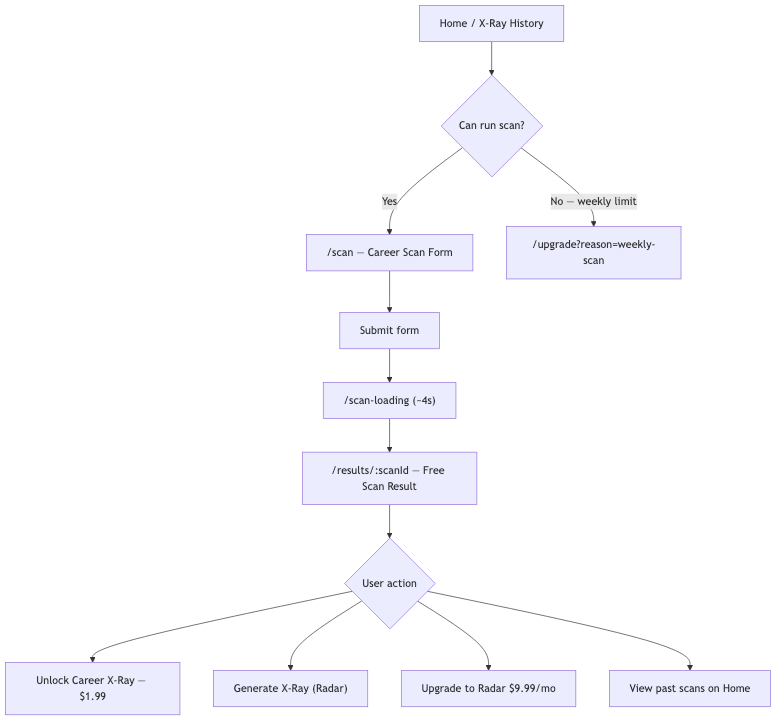
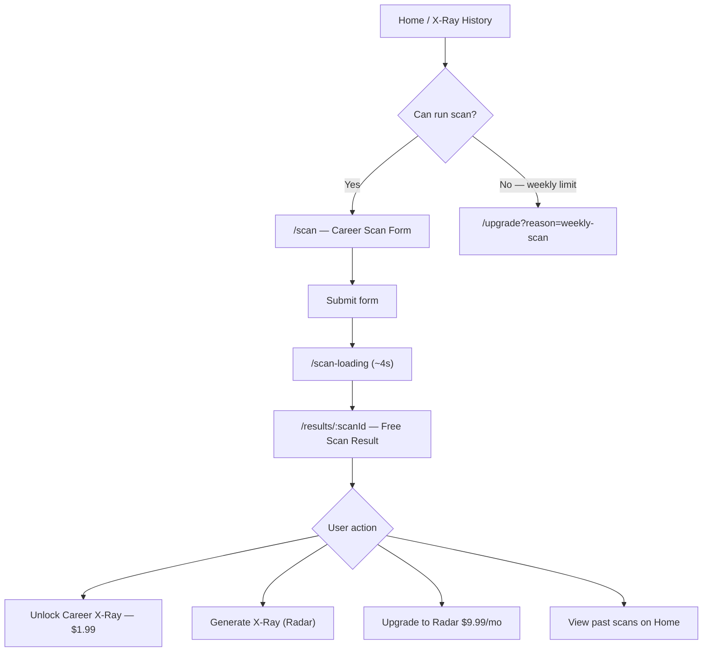
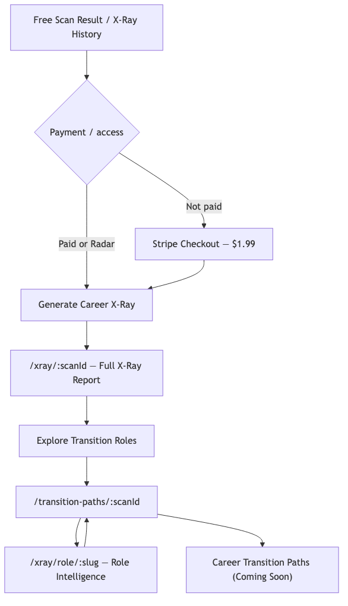
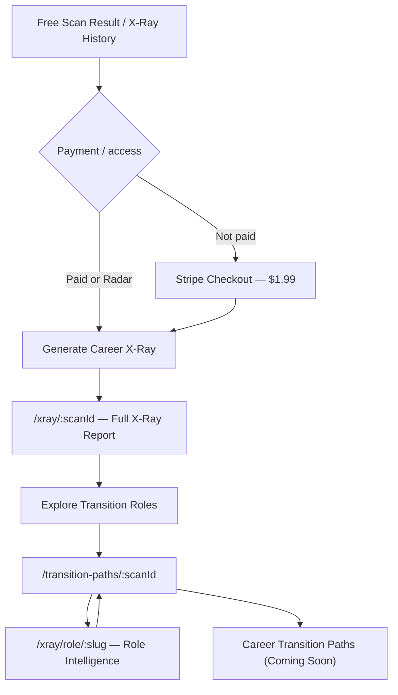
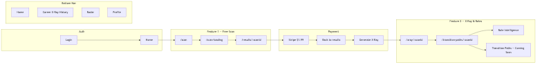
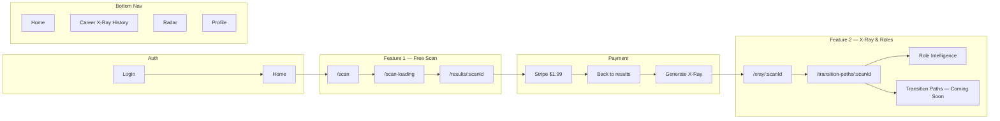

# Feature 1 & 2 — Process Flow

End-to-end user flows for **Free Career Scan** (Feature 1) and **Career X-Ray → Explore Transition Roles → Career Transition Paths** (Feature 2), as implemented in the mobile web app (`web/`).

---

## Flowcharts

### Figure 1 — Feature 1: Free Career Scan

### Figure 2 — Feature 2: Career X-Ray → Transition Roles → Transition Paths

### Figure 3 — Combined end-to-end happy path

---

## Navigation context

| Bottom nav tab | Route | Purpose |
|----------------|-------|---------|
| Home | `/home` | Dashboard; primary entry for starting a new scan |
| Career X-Ray | `/xray-history` | Scan history + X-Ray status per scan |
| Radar | `/radar` or `/upgrade` | AI Career Radar (subscriber vs upgrade) |
| Profile | `/profile` | Account, subscription, scan history links |

Free scans are started from **Home** or **Career X-Ray History** (`Run New Career Scan`), not from the bottom nav directly.

---

## Feature 1 — Free Career Scan

**Product:** Free Career Resilience Scan  
**Limit (free users):** 1 scan per 7-day rolling window  
**Radar subscribers:** Unlimited scans

See **Figure 1** above.

### Step-by-step

| Step | Route | What the user sees | How they get there |
|------|-------|--------------------|--------------------|
| 1 | `/home` | Welcome header, **Start New Scan** button, expandable **Past Scans** (if any) | Login → Home (default authenticated landing) |
| 2 | `/scan` | **Career Scan** form: Current Role, Target Role, Industry, Years Experience, Skills, Tools, Career Goal, Work Preference; weekly scan badge (e.g. “1 free scan left this week”) | Tap **Start New Scan** on Home, or **Run New Career Scan** on X-Ray History |
| 2a | `/upgrade?reason=weekly-scan` | Message that free users get 1 scan/week; CTA to **Upgrade to AI Career Radar — $9.99/month** | Tap **Start New Scan** when `canRunScan` is false |
| 3 | `/scan-loading` | Animated loading steps (~4s): mapping role, detecting AI exposure, finding opportunities, calculating gaps, building resilience index | Auto after successful form submit |
| 4 | `/results/:scanId` | **Free Scan Result** for **Current Role** and **Target Role**, each showing: Resilience Index, AI Exposure, Strengths, Vulnerabilities, Opportunity Zones | Auto redirect from scan loading |

### Free Scan Result — screen detail (`/results/:scanId`)

**Header**
- Title: “Free Scan Result”
- Subtitle: `{Current Role} → {Target Role}`

**Per role (Current + Target)**
- Resilience Index (score /100)
- AI Exposure badge (Low / Medium / High)
- Strengths (bullet list)
- Vulnerabilities (bullet list)
- Opportunity Zones (bullet list)

**Actions at bottom**
| User type | Primary CTA |
|-----------|-------------|
| Free, X-Ray not purchased | **Unlock Career X-Ray — $1.99** → Stripe Checkout |
| Free, X-Ray paid, not generated | **Generate Career X-Ray** |
| X-Ray already generated | **View Career X-Ray** → `/xray/:scanId` |
| Radar subscriber | **Generate Career X-Ray** (included) |
| Non-Radar | Secondary: **Upgrade to AI Career Radar — $9.99/month** |

**After Stripe success**
- User returns to results page with `?checkout=success&session_id=…`
- App confirms payment and refreshes entitlements
- CTA changes from **Unlock** to **Generate Career X-Ray**

---

## Feature 2 — Career X-Ray → Explore Transition Roles → Career Transition Paths

**Product:** Career X-Ray ($1.99 one-time per scan, or included with Radar)  
**Scope:** Deep report tied to a specific `scanId`

See **Figure 2** above.

### Step-by-step

| Step | Route | What the user sees | How they get there |
|------|-------|--------------------|--------------------|
| 1 | `/xray-history` | **Career X-Ray History** — list of scans with X-Ray status badges; **Run New Career Scan** | Bottom nav **Career X-Ray** |
| 2 | `/results/:scanId` or `/xray-history` | Unlock ($1.99) or Generate (if paid / Radar) | From free scan result or history card actions |
| 3 | Stripe Checkout | Payment for Career X-Ray (one-time, per scan) | **Unlock Career X-Ray — $1.99** |
| 4 | `/xray/:scanId` | Full **Career X-Ray** report (see sections below) | After generation, or **View Career X-Ray** from results |
| 5 | `/transition-paths/:scanId` | **Recommended Career Opportunities** — 5 role cards | **Explore Transition Roles** on X-Ray report |
| 6 | `/xray/role/:roleSlug` | **Role Intelligence** — deep dive on one recommended role | Tap a role card (chevron / card link) |
| 7 | `/transition-paths/:scanId` (footer) | Disabled **Career Transition Paths (Coming Soon)** | Bottom of Explore Transition Roles page |

### Career X-Ray History (`/xray-history`)

**Header**
- “Career X-Ray History”
- Subtitle: each X-Ray is tied to a specific scan

**Per scan card**
- `{Current Role} → {Target Role}`
- Date (scan or generated)
- Status badge: Not Purchased / Purchased / Generated / Included in Radar / etc.

**If X-Ray not generated**
- **View Free Scan** → `/results/:scanId`
- **Unlock Career X-Ray — $1.99** or **Generate Career X-Ray** (Radar)

**If X-Ray generated**
- Summary metrics: Readiness, Difficulty, Time, Salary Upside
- **View Details** (expand) → inline full X-Ray report sections

### Career X-Ray Report (`/xray/:scanId`)

**Header area**
- Current Role → Target Role
- Future Readiness, Transition Fit, Difficulty, Est. Time

**Sections (scroll)**
1. **Salary Outlook** — current vs target range, potential upside
2. **Transferable Strengths** — skills + why they matter
3. **Skill Gaps** — gap size, impact, explanation
4. **Recommended Action** — primary action, 30-day steps, expected impact
5. **Transition Snapshot** — time, difficulty, readiness, salary upside, market demand

**CTA**
- **Explore Transition Roles** → `/transition-paths/:scanId`

### Explore Transition Roles (`/transition-paths/:scanId`)

**Header**
- **Back** → returns to `/xray/:scanId`
- **X-RAY ID** badge (e.g. `XR-87521`)

**Title block**
- **Recommended Career Opportunities**
- “Based on your current role, skills, and market signals.”

**Per role card (typically 5)**
- Role icon + title
- Match Score ring (%)
- Difficulty · Transition Time · Salary Range
- **Why This Fits** (tap → Role Intelligence)
- **Top Missing Skills** (pills)

**Footer**
- Disclaimer about match scores and market data
- **Career Transition Paths (Coming Soon)** — disabled button (Feature 2 end state; not yet implemented)

### Role Intelligence (`/xray/role/:roleSlug`)

Reached from any recommended role card. Shows role-specific intelligence (skills, demand, fit) for the selected transition role. User returns via back navigation to Explore Transition Roles.

---

## Access rules (summary)

| Capability | Free user | After $1.99 X-Ray (per scan) | Radar subscriber ($9.99/mo) |
|------------|-----------|-------------------------------|----------------------------|
| Run scan | 1 / 7 days | 1 / 7 days | Unlimited |
| View free scan result | Yes | Yes | Yes |
| Career X-Ray for a scan | Pay $1.99 | Generate + view | Generate + view (included) |
| Explore Transition Roles | After X-Ray generated | Yes | Yes |
| Career Transition Paths | Coming Soon | Coming Soon | Coming Soon |

---

## Route reference

| Route | Feature | Screen name |
|-------|---------|-------------|
| `/home` | 1 | Home |
| `/scan` | 1 | Career Scan form |
| `/scan-loading` | 1 | Scan loading |
| `/results/:scanId` | 1 | Free Scan Result |
| `/upgrade` | 1 / 2 | Upgrade (Radar / scan limit) |
| `/xray-history` | 2 | Career X-Ray History |
| `/xray/:scanId` | 2 | Career X-Ray report |
| `/transition-paths/:scanId` | 2 | Explore Transition Roles |
| `/xray/role/:roleSlug` | 2 | Role Intelligence |
| `/upgrade?reason=weekly-scan` | 1 | Weekly scan limit paywall |

---

## End-to-end happy path (new user)

1. **Login** → `/home`
2. **Start New Scan** → `/scan` → fill form → submit
3. **Scan loading** → `/scan-loading` (~4s)
4. **Free Scan Result** → `/results/:scanId` — review current + target role insights
5. **Unlock Career X-Ray — $1.99** → Stripe → return to results
6. **Generate Career X-Ray** → `/xray/:scanId` — read full report
7. **Explore Transition Roles** → `/transition-paths/:scanId` — browse 5 roles
8. Tap a role → **Role Intelligence** → back
9. Scroll to bottom → **Career Transition Paths (Coming Soon)** (placeholder for future Feature 2 extension)

---

*Last updated: June 2026 — reflects `web/` routes and UI as implemented on branch Dev.*
