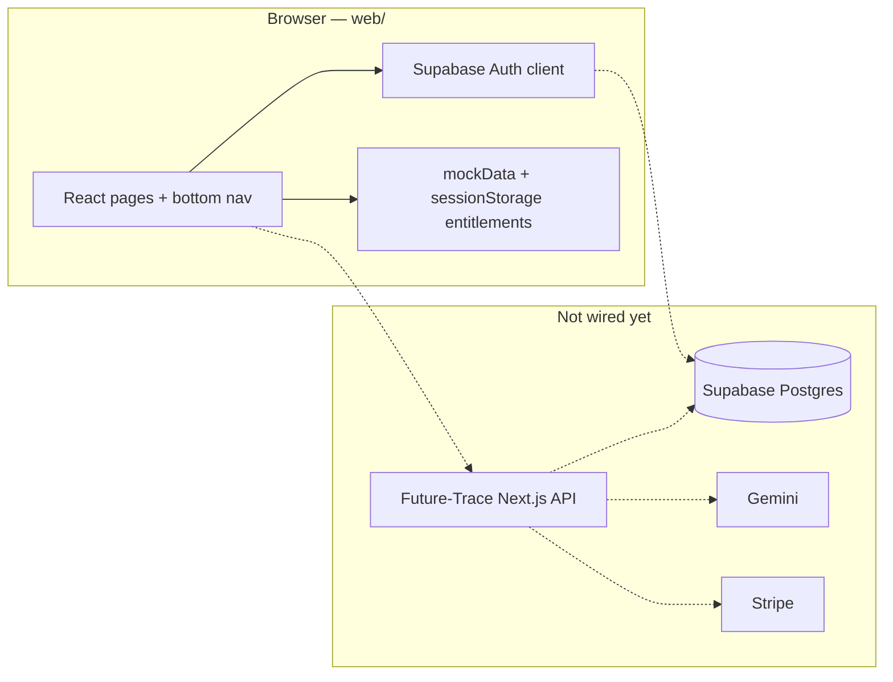
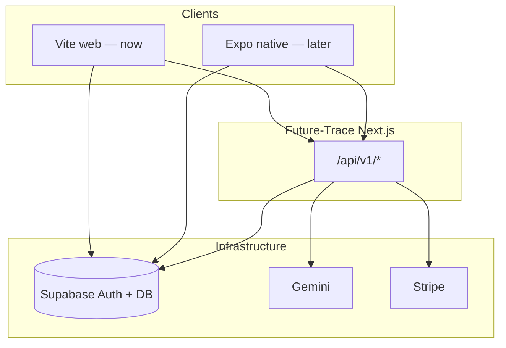
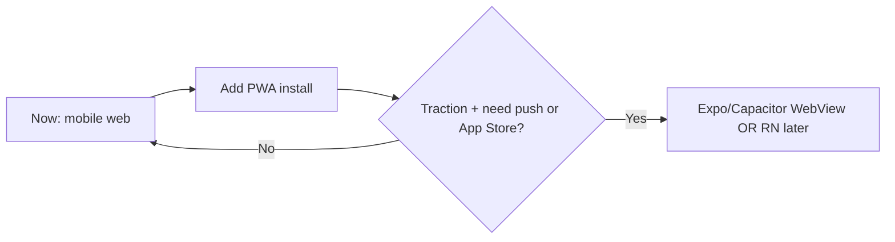

# Future Trace — Mobile vs Web

**Status:** Planning / product reference  
**Audience:** Sammy  
**Last updated:** June 2026  
**Scope:** Repo layout (`web/`, Expo root), distribution strategy, native roadmap  
**Related:** [PENDING_IMPLEMENTATION_CHECKLIST.md](./PENDING_IMPLEMENTATION_CHECKLIST.md), [BACKEND_AND_LLM_STRATEGY.md](./BACKEND_AND_LLM_STRATEGY.md), [web/README.md](../web/README.md)

---

## Summary

**Both exist in this repo — but only the web app is the real product today.** The native mobile shell is a stub.

| Question | Answer |
|----------|--------|
| Mobile app or web app? | **Web app is the product today.** Expo is splash-only. |
| Why “mobile” in the repo name? | Mobile-first **web** UX + planned **native** app later. |
| Where do users use it? | Browser (`web/`), ideally on a phone; desktop shows a phone-shaped frame. |
| App Store / Play Store app? | Not yet — only splash + bundle IDs configured. |
| Where’s AI, billing, persistence? | Intended in **Future-Trace** API + Supabase; not fully connected from `web/` yet. |

**Practical takeaway:** Treat `web/` as the app you build and ship. Treat the Expo project at the repo root as branding/splash groundwork for a later native wrapper or full React Native port.

---

## Part 1 — What’s in this repo and how it works

### What lives here

| Part | Location | What it is | Status |
|------|----------|------------|--------|
| **V1 product (web)** | `web/` | React + Vite app, mobile-first UI | **Complete UI** — scan, X-Ray, Radar, profile, auth |
| **Native mobile shell** | Root (`App.tsx`, Expo) | React Native / Expo app | **Splash only** — logo + loading, then blank screen |
| **Backend schema** | `supabase/migrations/` | Postgres tables, RLS, cron | Written, not fully wired to the UI yet |
| **API / LLM** | `Future-Trace/` (separate repo) | Next.js BFF, Gemini, Stripe | Planned / partially exists there |

The repo is named “mobile” because the **web app is designed like a phone app**, and a **future Expo app** is planned — but right now you ship and test the product in the **browser**.

### How the web app works (the real V1)

It’s a **mobile-first web app**, not a native install (yet).



**Run it:**

```bash
cd web
npm install
cp .env.example .env.local   # Supabase keys
npm run dev
```

**UX model:**

- Routes: `/home`, `/scan`, `/xray`, `/radar`, `/profile`, etc.
- `PhoneFrame` + `max-w-md` in `web/src/design-system/AppShell.tsx` — on desktop it looks like a phone; on a real phone it fills the screen.
- Bottom nav: **Home · Scan · X-Ray · Radar · Profile**
- Login via Supabase (email/password); protected routes need a session.
- Scan / X-Ray / Radar **content** still comes from `mockData.ts`; purchases unlock via `sessionStorage` (fake for now).

See [web/README.md](../web/README.md) for routes and products.

### How the Expo app works (repo root)

```bash
cd "/Users/sammy/future trace mobile"
npm install
npm run start:tunnel   # or start:ios / Expo Go QR
```

**What happens today:**

1. Native splash (`#0B0D17` navy) via `app.json`
2. `SplashScreen` component (~4 seconds) in `components/SplashScreen.tsx`
3. Empty placeholder in `App.tsx` — **no navigation, no product screens**

Bundle IDs are set (`com.futuretrace.mobile`) for a future App Store / Play build, but there is no WebView into `web/` and no ported screens yet.

### Target end-to-end architecture



1. User signs in (Supabase).
2. Submits career scan form → API → Gemini → results stored in `career_scans`.
3. Pays for X-Ray / Radar → Stripe → `user_entitlements` updated.
4. Pages read real data from API/DB instead of mocks.

Implementation steps: [PENDING_IMPLEMENTATION_CHECKLIST.md](./PENDING_IMPLEMENTATION_CHECKLIST.md).

---

## Part 2 — Native app vs web for traction

### Short answer

You **don’t need a native app** to get traction. For where Future Trace is today, a **mobile-first web app is the right default**. Native (or a thin wrapper) is a **later** decision — usually after you’ve validated signup, scan completion, and paid conversion.

### How hard is it to “turn this into a mobile app”?

Depends what you mean:

| Approach | Effort | What you get |
|----------|--------|----------------|
| **Keep as mobile web (status quo)** | Done | Works in Safari/Chrome on phones; add PWA install later |
| **PWA** (manifest + service worker) | **Low** (days) | Home-screen icon, splash, offline shell; still not in App Store |
| **Expo WebView shell** | **Low–medium** (1–2 weeks) | App Store listing that loads your `web/` URL; thin native layer |
| **Capacitor / similar wrapper** | **Low–medium** | Same idea: ship web UI inside native container |
| **Full React Native port** | **High** (months) | Rebuild or heavily refactor all screens; only if you need deep native APIs |

This repo is already set up for the **easy paths**: `web/` is the real product; root Expo is only a splash stub. You would **not** rewrite everything in React Native unless you have a clear native-only need.

### Do you need a native mobile app?

**Probably not for V1 traction.** For this product type, web is often enough.

**Fits web well:**

- Long forms (career scan)
- Reading dashboards (X-Ray, Radar)
- Email/password auth (already on Supabase)
- Stripe checkout on web (you keep more margin; no 15–30% App Store cut on subscriptions)
- Shareable links (`/scan`, `/career-xray`) for marketing and SEO

**Native helps when you need:**

- App Store **discovery** as a primary channel (search “career AI” in the store)
- **Push notifications** (monthly Radar alerts, “your scan is ready”)
- **Deep OS integration** (widgets, background jobs, subscription via IAP)
- Users who **refuse** to use a browser for paid tools (less common for B2C career products)

For a new product, discovery usually comes from **content, ads, LinkedIn, referrals, and landing pages** — not from being in the App Store on day one.

### Web vs native for gaining traction

| Factor | Mobile web (`web/`) | Native app |
|--------|---------------------|------------|
| Time to ship fixes | Hours | Days (review + releases) |
| Payment | Stripe web — full price | IAP rules; subscription complexity |
| Sharing / SEO | Strong | Weak (store listing only) |
| Iteration on paywall & onboarding | Fast A/B | Slower |
| “Feels like an app” | Good if mobile-first (yours is) | Slightly better polish |
| Credibility | Fine for SaaS | Nice for consumer apps |

**Recommendation for current stage:** **Stay web-first.** Finish backend (auth, scans, Stripe, Gemini) in `web/` + `Future-Trace` API. Measure:

- Signup → scan completed
- Free → X-Ray ($1.99)
- X-Ray → Radar ($9.99/mo)

If those work on mobile Safari/Chrome, you have product-market signal without native cost.

### Recommended path



1. **Now:** Ship and market the **web app** (already mobile-first).
2. **Soon (optional, cheap win):** PWA — manifest, icons, “Add to Home Screen” on iOS/Android.
3. **After traction:** If users ask for an app or you want push/Radar reminders → **WebView shell** in Expo (reuse 100% of `web/`).
4. **Only if needed:** Full native UI for features WebView can’t do well.

### When to reconsider native

Move up the native timeline if:

- **>40%** of paid users are on mobile web and complain about browser friction
- You want **Radar push** (“3 new signals this month”) as a core retention loop
- You’re spending on **Apple Search Ads** and need a store presence
- Stripe web checkout feels like a conversion blocker (uncommon for $1.99 / $9.99 price points)

### Bottom line

- **Difficulty:** Wrapper/PWA = easy; full native = hard and largely redundant with the current codebase.
- **Need native now?** **No** — not for validating traction.
- **Strategy:** **Web app for traction**; treat App Store as a distribution layer later, not a prerequisite.

The biggest lever right now isn’t App Store vs web — it’s **replacing mocks with real scans, entitlements, and Stripe** so mobile web users can complete the funnel. Native can wait until that funnel works.

---

## Decision log (fill in when you choose)

| Decision | Options | Choice | Date |
|----------|---------|--------|------|
| V1 distribution | Web only / Web + PWA / Web + store wrapper | _TBD_ | |
| Free scan limit | 1 lifetime / 1 per month | _TBD_ | |
| Auth providers | Email only / + Google / + Apple | _TBD_ | |
| Native trigger | Push needed / App Store ads / user demand | _TBD_ | |
