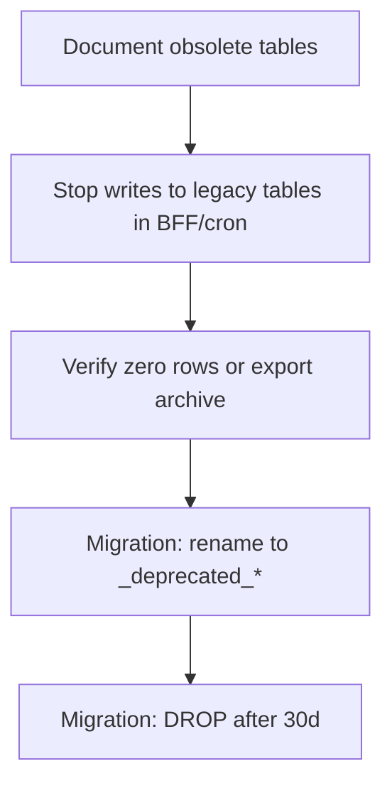

# Future Trace — Obsolete / Unused Database Tables

**Status:** Reference for cleanup planning  
**Audience:** Engineering  
**Last updated:** June 2026  
**Scope:** Supabase migrations vs `web/src` usage  
**Related:** [ARCHITECTURE_AND_DATA_FLOWS.md](./ARCHITECTURE_AND_DATA_FLOWS.md), [DATABASE_DESIGN.md](./DATABASE_DESIGN.md)

---

## Important

- **Do not drop tables in production without a migration plan and backup.**
- Many tables were created for **future features** (Radar market layer, ingestion pipeline, native MVP content). They are empty or seed-only today.
- Migrations use `CREATE TABLE IF NOT EXISTS` — some names appear in multiple migrations; **first migration wins** structurally.

---

## Summary

| Category | Table count (approx.) | Web usage |
|----------|----------------------|-----------|
| Actively used by web | ~20 | Direct `.from()` / `.rpc()` |
| Superseded / legacy | ~25 | No web refs; replaced by newer tables |
| Planned / not wired | ~40 | Schema ready; UI or ETL not built |
| Dev / test only | 1 | Pipeline test |

---

## Tier 1 — Safe to deprecate (high confidence)

These have **zero references in `web/src`** and are **superseded** by newer designs.

| Table(s) | Original purpose | Superseded by | Action |
|----------|------------------|---------------|--------|
| `user_profiles` | Legacy profile from initial mobile schema | `profiles` | Deprecate; do not write |
| `ai_scan_history` | Pre–career-intelligence scan storage | `career_scans` | Cron still purges; stop writing |
| `career_xray_snapshots` | Early X-Ray purchase model (no `scan_id`) | `career_xrays` | Deprecate |
| `plans`, `plan_features` | Old plan catalog | `products` + `user_entitlements` | Deprecate |
| `web_dev_git_sync_log` | Dev pipeline sync test | — | Drop in non-prod; optional in prod |

### Initial mobile MVP content stack (20260528120000)

No web references. Editorial/content MVP before career intelligence schema.

| Table | Notes |
|-------|-------|
| `content_feed_items` | Content feed |
| `milestone_display`, `milestone_sections`, `milestone_sources`, `milestone_industry_tags`, `milestone_job_tags` | Editorial milestones (not transition `weekly_milestones`) |
| `milestones` (initial schema) | Conflicts in name with CI `milestones` — different table |
| `score_jobs`, `exposure_scores` | Async scoring pipeline |
| `job_exposure_groups`, `job_exposure_examples` | Reference content |
| `industries`, `industry_risks` (initial) | Superseded by CI `industries` |
| `app_metadata`, `search_topics`, `user_recent_searches` | App config / search |

**Action:** Document as legacy; drop in a future migration after confirming no external ETL depends on them.

---

## Tier 2 — Superseded parallel designs (medium confidence)

Built for alternate product paths; web uses different tables.

| Table(s) | Purpose | Web uses instead |
|----------|---------|------------------|
| `master_milestone_blueprints` | Reusable milestone templates | `generateWeeklyMilestones.ts` (in-code templates) |
| `user_sprint_progress` | Blueprint progress tracking | `weekly_milestones` + task completion |
| `roadmap_task_completions` | Premium roadmap micro-tasks | `milestone_tasks` status |
| `user_resume_scans` | Matcher/resume tier experiment | `career_scans` |
| `user_career_profiles` | Canonical career state | `profiles` + latest `scan_inputs` |
| `user_skills` | Skill inventory | Embedded in scan/X-Ray JSON |

---

## Tier 3 — Planned but not wired to web (keep for roadmap)

Schema exists; **no `web/src` reads**. Do not drop until feature is abandoned.

### Radar product (6 tables)

| Table | Purpose |
|-------|---------|
| `radar_snapshots` | Monthly dashboard snapshot |
| `radar_sub_metrics` | Sub-scores |
| `radar_skill_gap_progress` | Skill gap trends |
| `radar_signals` | Market signals |
| `radar_insight_items` | Insight bullets |
| `radar_monthly_diffs` | Month-over-month diffs |

**Note:** `/radar` redirects to `/transition`. Legacy `RadarPage.tsx` still uses mocks.

### Market intelligence / ingestion (~20 tables)

| Table group | Purpose |
|-------------|---------|
| `salary_observations`, `role_salary_benchmarks`, `role_demand_observations`, `skill_momentum_observations` | Market facts |
| `market_signals`, `market_snapshots` | Aggregated context |
| `role_ai_exposure_snapshots`, `role_demand_ai_adjustments`, `role_salary_ai_adjustments`, `role_evolution_timeline` | Role-level AI adjustments |
| `geo_markets`, `data_sources` | Provenance |
| `integration_sync_jobs`, `integration_sync_runs`, `integration_staging_raw` | External API ingestion |
| `title_normalization_requests` | Job title normalization queue |
| `analytics_career_scan_aggregates` | Anonymized aggregates |

### Other planned

| Table | Purpose |
|-------|---------|
| `role_intelligence_reports` | Per-role intelligence pages |
| `ai_evolution_eras`, `milestones` (CI editorial) | AI timeline content |
| `scan_transition_role_suggestions` | Normalized scan role suggestions (written, not read by web) |
| `scan_generation_context` | Market facts used during scan generation |
| `purchases`, `user_subscriptions` | Purchase audit (web uses RPCs → `user_entitlements`) |
| `subscriptions` (two migration definitions) | Web never queries; entitlements are source of truth |
| `scan_rate_limits` | Rate limiting (enforce in BFF instead today) |
| `content_cache` | LLM response cache |
| `prompt_versions` | Prompt versioning |
| `llm_jobs` | LLM job queue — **BFF should write; web does not read** |

---

## Tier 4 — Transitional (read path only)

| Table | Status |
|-------|--------|
| `xray_reports` | Read by `xrayDataService.ts` (legacy path) |
| `xray_skill_gaps`, `xray_transition_matches` | Joined via `xray_reports` |
| **Write path today:** `career_xrays.xray_result_json` via `xrayService.ts` |

**Action:** Migrate readers to `career_xrays`; then deprecate normalized xray tables.

---

## Tier 5 — Reference / catalog (keep)

Read-only taxonomy and seeds. Not obsolete.

| Table | Usage |
|-------|-------|
| `domains`, `industries`, `occupation_roles`, `role_aliases` | Role taxonomy |
| `skills`, `role_skills`, `role_adjacency` | Skill graph |
| `products` | Product catalog + Stripe price IDs |

`occupation_roles` is joined in `xrayDataService.ts`.

---

## Tier 6 — Compliance (keep — do not drop)

| Table | Purpose |
|-------|---------|
| `compliance_logs` | Audit trail; survives account deletion |
| `user_consents` | GDPR consent records (wire from app) |

---

## Tables actively used by web (do NOT drop)

```
profiles
career_scans, scan_inputs, scan_strengths, scan_vulnerabilities, scan_opportunity_zones
career_xrays
user_entitlements, usage_limits, subscription_usage
career_goals, weekly_milestones, milestone_tasks
transition_notifications, goal_switch_history
plan_update_recommendations, career_market_signals, milestone_versions
xray_reports (+ xray_skill_gaps, xray_transition_matches, occupation_roles) — transitional reads
```

---

## Recommended cleanup sequence



1. **Pre-launch:** No drops — focus on wiring active tables.
2. **Post-launch (30+ days):** Drop `web_dev_git_sync_log`, `ai_scan_history` writes.
3. **After X-Ray migration:** Deprecate `xray_reports` normalized stack.
4. **If Radar product abandoned:** Drop `radar_*` tables as a set.
5. **After ingestion decision:** Drop or keep market tables as a unit.

---

## RPCs not called from web (but may be needed)

| RPC | Notes |
|-----|-------|
| `consume_free_scan()` | Web uses `usage_limits` instead |
| `log_compliance_event()` | Should wire from delete/export flows |
| `monthly_career_plan_refresh()` | Needs cron scheduling |
