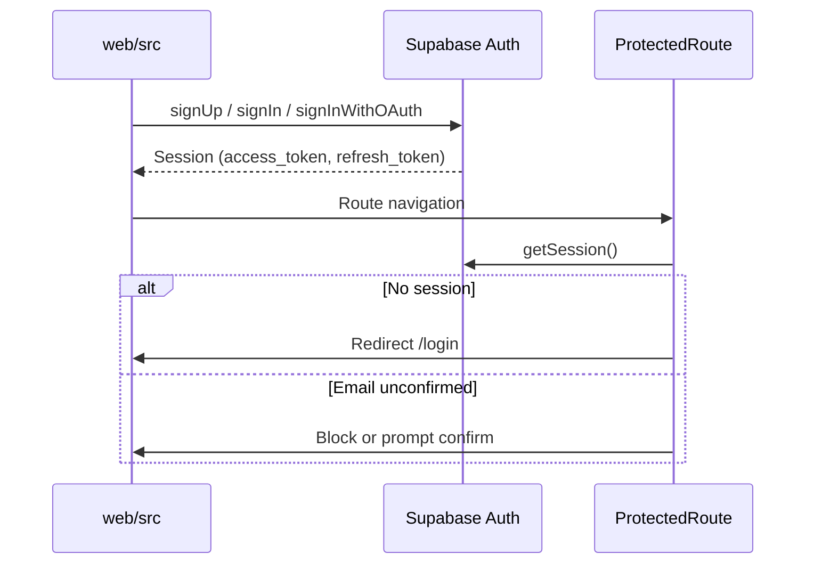

# Future Trace — Tech Stack Reference

**Status:** As-built reference  
**Audience:** Engineering, onboarding  
**Last updated:** June 2026  
**Scope:** `web/`, Supabase, Future-Trace BFF, Expo root  
**Related:** [ARCHITECTURE_AND_DATA_FLOWS.md](./ARCHITECTURE_AND_DATA_FLOWS.md), [web/README.md](../web/README.md)

---

## 1. Client — mobile web PWA (`web/`)

| Category | Technology | Version (approx.) | Purpose |
|----------|------------|-------------------|---------|
| Language | TypeScript | ~6.0 | Type safety |
| UI framework | React | 19.x | Components, hooks |
| Build tool | Vite | 8.x | Dev server, production bundle |
| Routing | React Router DOM | 7.x | `createBrowserRouter`, protected routes |
| Styling | Tailwind CSS | 4.x | Utility-first + `design-system/tokens.css` |
| CSS utilities | clsx, tailwind-merge | Latest | `cn()` helper |
| Backend SDK | @supabase/supabase-js | 2.x | Auth, PostgREST, RPC |
| HTTP client | Native `fetch` | — | BFF calls via `apiClient.ts` |
| PWA | Custom SW + manifest | — | `public/sw.js`, `manifest.webmanifest` |
| Payments (client) | None — redirect only | — | Stripe Checkout via BFF URL |

**Not in the browser:** Gemini, Stripe secret keys, service role key.

---

## 2. Native shell — Expo (repo root)

| Category | Technology | Status |
|----------|------------|--------|
| Framework | Expo SDK 54 | Splash screen only |
| Bundle ID | `com.futuretrace.mobile` | Configured, not shipped |
| Future path | WebView → hosted PWA | Planned post-traction |

---

## 3. Backend — Supabase

| Service | Usage |
|---------|-------|
| **Auth** | Email/password, OAuth-ready; JWT sessions with refresh |
| **Postgres** | Primary data store (~90 tables across migrations) |
| **RLS** | Row-level security on all user tables |
| **RPC** | Milestone gating, usage limits, plan updates, checkout (dev) |
| **pg_cron** | Daily data minimization (3 jobs) |
| **Realtime** | Not used in V1 web |

**Connection from web:**

```ts
// web/src/lib/supabaseClient.ts
createClient(VITE_SUPABASE_URL, VITE_SUPABASE_ANON_KEY, {
  auth: { persistSession: true, autoRefreshToken: true, detectSessionInUrl: true }
})
```

---

## 4. BFF — Future-Trace (separate Next.js repo)

| Category | Technology | Purpose |
|----------|------------|---------|
| Framework | Next.js App Router | API routes |
| LLM | Google Gemini 1.5 Flash | Scan, X-Ray, enrichment |
| Payments | Stripe SDK | Checkout sessions, webhooks |
| DB access | Supabase service role | Writes bypassing RLS where needed |

### API calls from `web/src` (as-built)

| Method | Endpoint | Service file | Auth | LLM |
|--------|----------|--------------|------|-----|
| POST | `/api/v1/checkout` | `checkoutService.ts` | Bearer JWT | No |
| POST | `/api/v1/checkout/confirm` | `checkoutService.ts` | Bearer JWT | No |
| POST | `/api/v1/xray/generate` | `xrayService.ts` | Bearer JWT | **Yes** (server) |

### API calls planned (not wired in web yet)

| Method | Endpoint | Purpose |
|--------|----------|---------|
| GET | `/api/v1/me` | Profile + entitlements aggregate |
| POST | `/api/v1/scans` | Create scan job |
| GET | `/api/v1/scans/:id` | Poll scan status |
| GET | `/api/v1/scans/:id/result` | Full scan result |
| GET | `/api/v1/xray/latest` | Latest X-Ray report |
| GET | `/api/v1/radar/latest` | Monthly snapshot (legacy product) |
| POST | `/api/cron/radar-refresh` | Batch subscriber refresh |

**Dev fallback:** `web/dev-api/checkoutDevPlugin.ts` — Vite middleware when `STRIPE_SECRET_KEY` is set locally.

**Proxy:** `vite.config.ts` proxies non-checkout `/api/*` → `http://localhost:3000`.

---

## 5. Authentication

### Flow



### Key files

| File | Role |
|------|------|
| `web/src/lib/supabaseClient.ts` | Supabase client singleton |
| `web/src/auth/AuthProvider.tsx` | Session state, signIn/Out methods |
| `web/src/auth/ProtectedRoute.tsx` | Requires authenticated + confirmed email |
| `web/src/auth/GuestRoute.tsx` | Redirects logged-in users to `/home` |
| `web/src/auth/authUtils.ts` | Email confirmation check |
| `web/src/lib/RequireTransitionSubscriber.tsx` | Gates `/transition` routes |

### DB on signup

Trigger `handle_new_user_signup()` creates:

- `profiles` row
- `user_entitlements` row (`free_scans_remaining`, flags)
- `compliance_logs` entry (`ACCOUNT_CREATED`)

### Token usage

| Consumer | Header |
|----------|--------|
| Supabase client | Automatic (SDK) |
| BFF `apiClient.ts` | `Authorization: Bearer <access_token>` |

---

## 6. LLM (server-side only)

| Setting | Value |
|---------|-------|
| Provider | Google Gemini |
| Default model | `gemini-1.5-flash` |
| API key location | `GEMINI_API_KEY` in Future-Trace env **only** |
| Job logging | `llm_jobs` table (tokens, status, raw_response → redacted 90d) |
| Client LLM calls | **None** |

### Where LLM runs (target production)

| Feature | Trigger | Approx. cost/call |
|---------|---------|-------------------|
| Free Career Scan | User submit | $0.001–$0.003 |
| Career X-Ray | After payment + generate | $0.005–$0.015 |
| Role intelligence | Cache miss | $0.003–$0.008 |
| Monthly plan/radar refresh | Cron | $0.003–$0.010 |

### Current state (June 2026)

| Feature | LLM status |
|---------|------------|
| Scan | **Mock** — `buildMockFreeResult()` in `scanService.ts` |
| X-Ray | **Mock fallback** — `buildMockXrayResult()` if BFF fails |
| Milestones | **No LLM** — `generateWeeklyMilestones.ts` templates |
| Plan updates | **RPC + templates** — optional LLM for signal copy later |

---

## 7. Payments — Stripe

| Product | Price | Product key | Entitlement flag |
|---------|-------|-------------|------------------|
| Career X-Ray (extra) | $1.99 one-time | `career_xray_extra` | X-Ray on scan |
| AI Career Transition | $9.99/month | `transition` / `ai_career_transition_monthly` | `has_radar` + usage quotas |

### Checkout flow

1. `startCheckout()` → BFF creates Stripe Checkout Session
2. User pays on Stripe-hosted page
3. Return URL with `?checkout=success&session_id=...`
4. `useCheckoutReturn` → `confirmCheckout(sessionId)`
5. BFF/webhook updates `user_entitlements` + `subscription_usage`

### Dev RPCs (local only)

- `register_transition_checkout(p_session_id)`
- `fulfill_transition_checkout(p_session_id)`

---

## 8. Direct Supabase access from web

### Tables read/written

| Table | Primary service |
|-------|-----------------|
| `profiles` | `profileService.ts` |
| `career_scans`, `scan_inputs`, `scan_strengths`, `scan_vulnerabilities`, `scan_opportunity_zones` | `scanService.ts` |
| `career_xrays` | `xrayService.ts`, `accessService.ts`, `transitionService.ts` |
| `user_entitlements` | `entitlementsService.ts` |
| `usage_limits` | `accessService.ts` |
| `subscription_usage` | `subscriptionUsageService.ts` |
| `career_goals`, `weekly_milestones`, `milestone_tasks` | `transitionService.ts` |
| `transition_notifications` | `notificationService.ts` |
| `plan_update_recommendations`, `career_market_signals`, `milestone_versions` | `planUpdateService.ts` |
| `goal_switch_history` | `transitionService.ts` |
| `xray_reports`, `xray_skill_gaps`, `xray_transition_matches` | `xrayDataService.ts` (legacy read path) |

### RPCs called

| RPC | Service |
|-----|---------|
| `get_active_transition_subscription` | `subscriptionUsageService.ts` |
| `get_or_create_monthly_usage` | `subscriptionUsageService.ts` |
| `increment_subscription_usage` | `subscriptionUsageService.ts` |
| `get_visible_milestones` | `transitionService.ts` |
| `get_visible_milestone_with_tasks` | `transitionService.ts` |
| `refresh_career_market_signals` | `planUpdateService.ts` |
| `check_plan_updates_for_goal` | `planUpdateService.ts` |
| `apply_plan_update` / `dismiss_plan_update` | `planUpdateService.ts` |

---

## 9. Environment variables

### Web (`web/.env.local`)

| Variable | Required | Description |
|----------|----------|-------------|
| `VITE_SUPABASE_URL` | Yes | Supabase project URL |
| `VITE_SUPABASE_ANON_KEY` | Yes | Anon/public key |
| `VITE_API_BASE_URL` | Prod yes | Future-Trace origin (empty = same-origin in dev) |
| `STRIPE_SECRET_KEY` | Dev only | Powers `checkoutDevPlugin` |
| `STRIPE_XRAY_PRICE_ID` | Dev checkout | Stripe price for X-Ray |
| `STRIPE_RADAR_PRICE_ID` | Dev checkout | Stripe price for subscription |
| `SUPABASE_SERVICE_ROLE_KEY` | Dev optional | Dev checkout fulfillment fallback |

### BFF (Future-Trace)

| Variable | Description |
|----------|-------------|
| `GEMINI_API_KEY` | LLM |
| `STRIPE_SECRET_KEY` | Checkout + webhooks |
| `STRIPE_WEBHOOK_SECRET` | Verify webhooks |
| `SUPABASE_SERVICE_ROLE_KEY` | Server writes |
| `NEXT_PUBLIC_SUPABASE_URL` | BFF Supabase client |

---

## 10. Key directories

```
future trace mobile/
├── web/                          # Production client (PWA)
│   ├── src/
│   │   ├── auth/                 # Supabase auth
│   │   ├── lib/                  # Services, hooks
│   │   ├── lib/transition/       # Transition domain
│   │   ├── pages/                # Route screens
│   │   ├── components/           # Shared UI
│   │   └── design-system/        # Tokens, AppShell, BottomNav
│   ├── public/                   # PWA manifest, SW, icons
│   └── dev-api/                  # Local Stripe checkout plugin
├── supabase/migrations/          # Postgres schema (35 files)
├── components/                   # Expo splash only
└── docs/                         # Product & engineering docs
```

---

## 11. Product routes (web)

| Route | Guard | Data source |
|-------|-------|-------------|
| `/login` | Guest | Supabase Auth |
| `/home` | Auth | Dashboard hooks |
| `/scan` | Auth | Form → scanService |
| `/results/:scanId` | Auth | career_scans |
| `/xray-history` | Auth | career_xrays join |
| `/xray/:scanId` | Auth | career_xrays |
| `/upgrade` | Auth | Stripe via BFF |
| `/transition` | Subscriber | transitionService |
| `/transition/week/:id` | Subscriber | RPC milestones |
| `/transition/plan/:goalId` | Subscriber | weekly_milestones |
| `/transition/plan-updates/:id` | Subscriber | plan_update_recommendations |
| `/notifications` | Subscriber | transition_notifications |
| `/profile` | Auth | profiles + entitlements |
